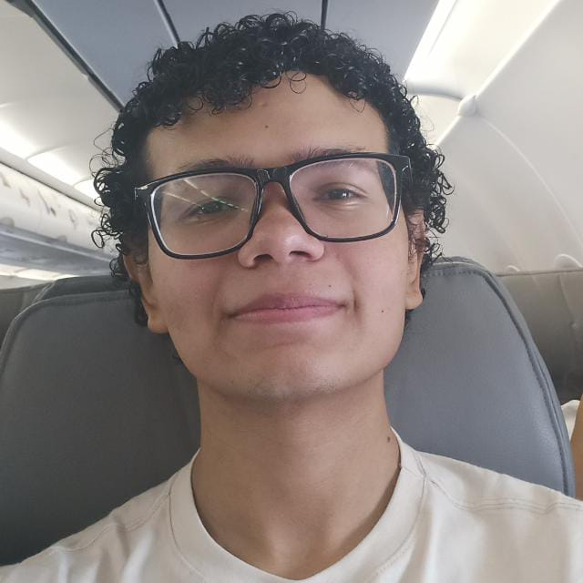
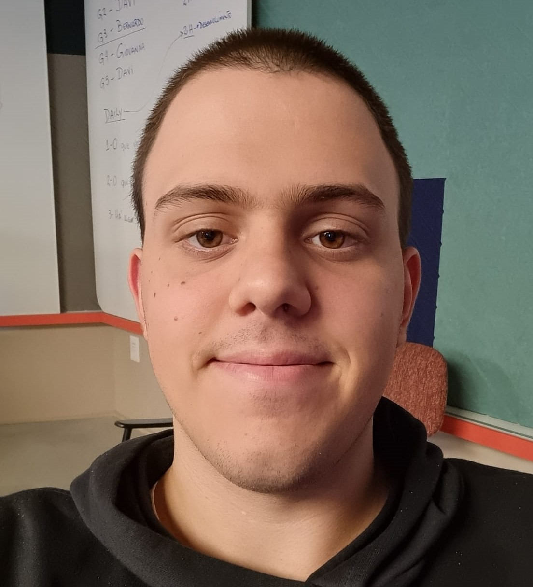
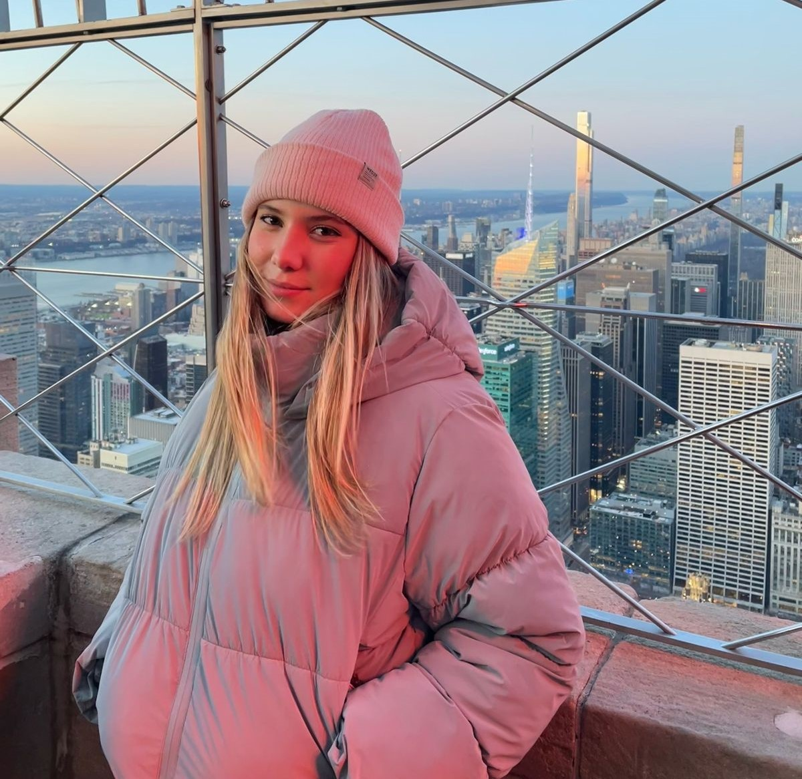
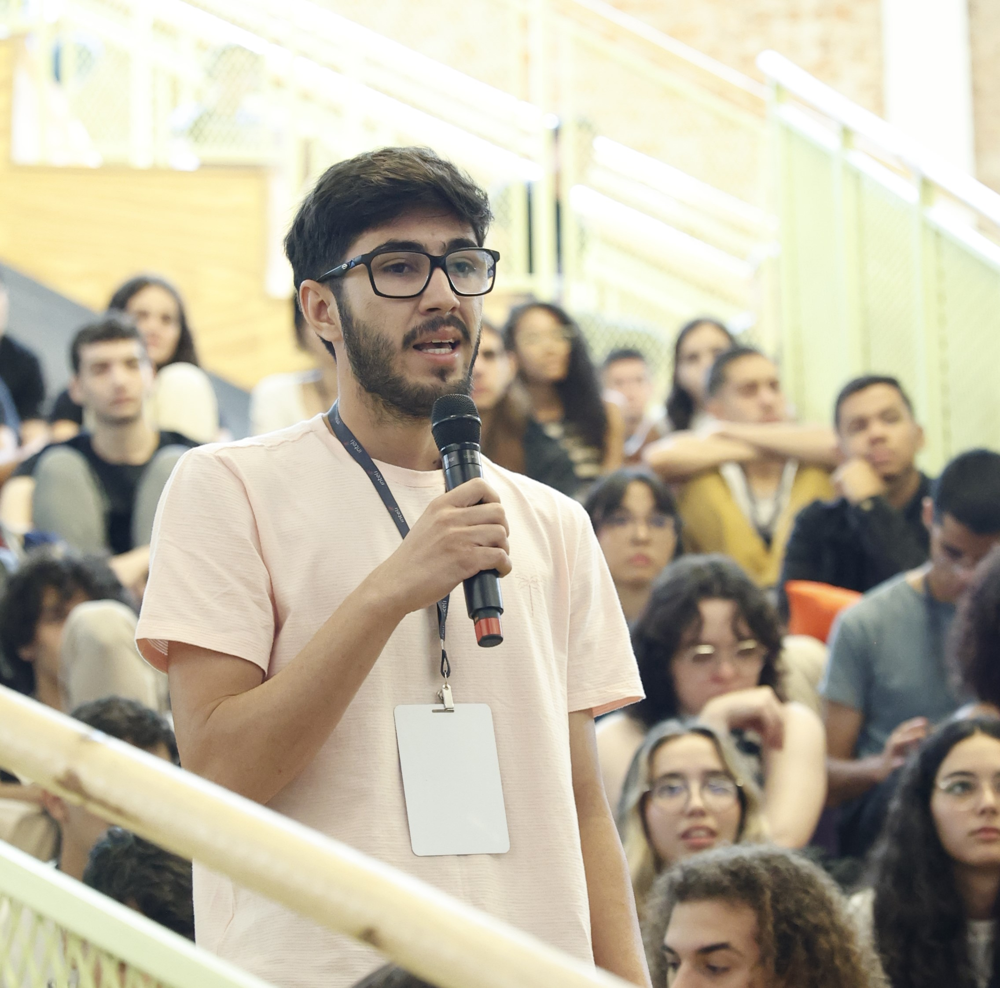

# Inteli - Instituto de Tecnologia e Liderança 

 

# Nome do projeto
 
## 💫 COMETA

## 👨‍🎓 Integrantes: 

  <table>
    <tr>
      <td align="center"><a href="https://www.linkedin.com/in/bernardo-meirelles-117243241/"> <b>Bernardo M.</b></a></td>
      <td align="center"><a href="https://www.linkedin.com/in/eduardo-ferrari-aaa39b265/"> <b> Bruno Fabiani</b></a></td>
      <td align="center"><a href="https://www.linkedin.com/in/isadora-gatto-0900a9283?utm_source=share&utm_campaign=share_via&utm_content=profile&utm_medium=ios_app"> <b>Isadora Gatto</b></a></td>
      <td align="center"><a href="https://www.linkedin.com/in/marcoruas/"> <b>Marco Peixoto</b></a></td>
       <td align="center"><a href="https://www.linkedin.com/in/rafael-barbosa-b4386b293/"> <b>Rafael Barbosa</b></a></td>
      <td align="center"><a href=""> <b>Tainá Cortez</b></a></td>
      <td align="center"><a href="https://www.linkedin.com/in/wildis-filho/"> <b>Wildisley Filho</b></a></td>

  </table>

## 👩‍🏫 Professores:
### Orientador(a) 
- <a href="https://www.linkedin.com/in/marcelo-gon%C3%A7alves-phd-a550652/">Marcelo Gonçalves</a>
### Instrutores
- <a href="https://www.linkedin.com/in/victorbarq/">Bruna Mayer</a> 
- <a href="https://www.linkedin.com/in/egondaxbacher/">Egon Daxbacher</a>
- <a href="https://www.linkedin.com/in/victorbarq/">Filipe Gonçalves</a> 
- <a href="https://www.linkedin.com/in/victorbarq/">Fillipe Resina</a>
- <a href="https://www.linkedin.com/in/victorbarq/">Kizzy Terra</a>
- <a href="https://www.linkedin.com/in/victorbarq/">Ricardo Missori</a> 

## 📜 Descrição

*Descreva seu projeto (até 600 palavras)*

*Inclua o link para o jogo aqui*

## 📁 Estrutura de pastas

Dentre os arquivos e pastas presentes na raiz do projeto, definem-se:

- <b>assets</b>: aqui estão os arquivos relacionados a elementos não-estruturados deste repositório, como imagens.

- <b>document</b>: aqui estão todos os documentos do projeto, como o Game Development Document (GDD) bem como documentos complementares, na pasta "other".

- <b>src</b>: Todo o código fonte criado para o desenvolvimento do projeto do jogo.

- <b>README.md</b>: arquivo que serve como guia e explicação geral sobre o projeto e o jogo (o mesmo que você está lendo agora).

## 🔧 Como executar o código

*Acrescentar as informações necessárias sobre pré-requisitos (IDEs, serviços etc.) e instalação básica do projeto, descrevendo eventuais versões utilizadas. Colocar um passo a passo de como o leitor pode baixar o código e executar o jogo a partir de sua máquina ou seu repositório.*

## 🗃 Histórico de lançamentos

* 0.5.0 - XX/XX/2024
    * 
* 0.4.0 - XX/XX/2024
    * 
* 0.3.0 - XX/XX/2024
    * 
* 0.2.0 - 01/03/2024
    * Criação dos mapas e personagens finais
    * Criação do roteiro final do jogo
    * Lançamento de novas cenas
* 0.1.0 - 16/02/2024
    * Lançamento do primeiro protótipo
    * Criação do código de movimentação e de novas cenas
    * Desing do personagem principal

## 📋 Licença/License

<a property="dct:title" rel="cc:attributionURL" href="https://github.com/Intelihub/Template_M1">MODELO GIT INTELI</a> by <a rel="cc:attributionURL dct:creator" property="cc:attributionName" href="https://github.com/Intelihub/Template_M1">Inteli, Nome do integrante 1, Nome do integrante 2, Nome do integrante 3, Nome do integrante 4, Nome do integrante 5, Nome do integrante 6, Nome do integrante 7</a> is licensed under <a href="http://creativecommons.org/licenses/by/4.0/?ref=chooser-v1" target="_blank" rel="license noopener noreferrer" style="display:inline-block;">Attribution 4.0 International</a>.

