# GDD - Game Design Document - Módulo 1 - Inteli

## :dizzy: COMETA

#### Nomes dos integrantes do grupo
- <a>Bernardo de Figueiredo Meirelles</a>
- <a>Bruno Jancsó Fabiani</a>
- <a>Isadora Tribst Gatto</a>
- <a>Marco Ruas Sales Peixoto</a>
- <a>Rafael Furtado Victor dos Santos</a>
- <a>Tainá de Paiva Cortez</a>
- <a>Wildisley José de Souza Filho</a>

## Sumário

[1. Introdução](#c1)

[2. Visão Geral do Jogo](#c2)

[3. Game Design](#c3)

[4. Desenvolvimento do jogo](#c4)

[5. Casos de Teste](#c5)

[6. Conclusões e trabalhos futuros](#c6)

[7. Referências](#c7)

[Anexos](#c8)

 

# 1. Introdução 

## 1.1. Escopo do Projeto

### 1.1.1. Contexto da indústria 

#### 5 Forças de Porter 

 O que são as 5 Forças de Porter? 

As Cinco Forças de Porter é um modelo de análise da competitividade de um setor industrial. Ele considera cinco elementos-chave: a rivalidade entre empresas do mesmo segmento, o poder de barganha dos fornecedores e dos clientes, a ameaça de produtos substitutos e a possibilidade de entrada de novos concorrentes. Esses fatores influenciam a dinâmica competitiva do setor, afetando aspectos como a disputa por clientes, preços, qualidade dos produtos e lucratividade das empresas.

 Figura 1 
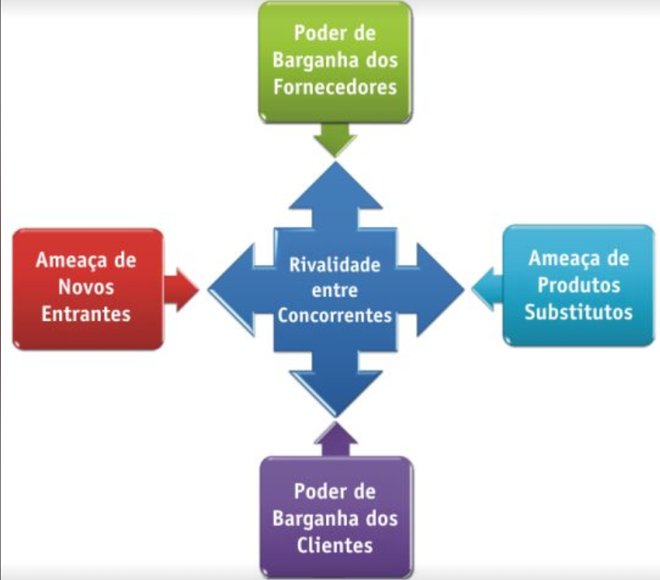
Fonte: TEM QUE COLOCAR 2024

 Figura 2 - Análise 5 Forças de Porter 
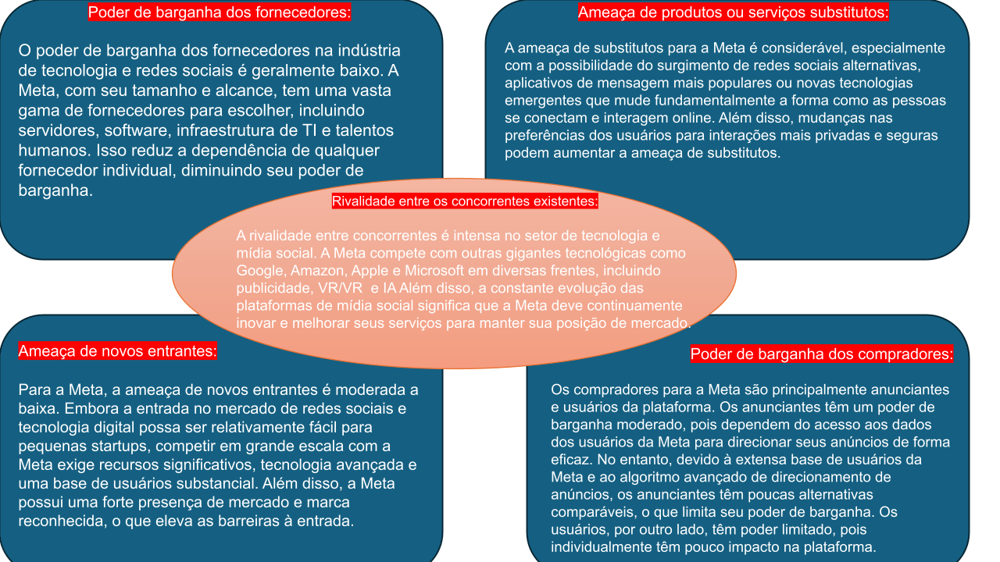
Fonte: Material produzido pelos autores, 2024

&nbsp;&nbsp;&nbsp;&nbsp;CONCORRÊNCIA META

- Roblox: uma empresa que simula mundos virtuais permitindo que seus jogadores criem seu próprio mundo. Com uma ideia semelhante, a Meta possuiu o metaverso, espaço no ambiente virtual, onde é possível estudar, trabalhar e ter uma vida social através de seus avatares.
No segundo trimestre de 2021, o número de usuários no Roblox foi de 43,2 milhões, apresentando um crescimento de 29% em relação ao último ano - mostrando assim a potência do RBLX com seus concorrentes. 

- TikTok: o aplicativo de vídeos curtos apresentou um aumento de 43% no número de usuários em 2023. A maioria dos usuários prefere o TikTok em comparação ao reels (uma cópia dos vídeos de curta metragem do tiktok), apesar de haverem mais usuários de produtos Meta em um contexto global.
    - Segundo a Forbes Brasil, a escolha de criadores de conteúdo está no tiktok, com 56,7% da preferência. Em segundo lugar está o Instagram com 36,6%. Por mais que o Instagram ainda seja mais usado que o tiktok, essa plataforma se tornou um concorrente notável já que seu crescimento é muito rápido com avanço de 210% de 2021 para 2022 tornando-se a marca com o crescimento mais rápido.

- Apple: Em relação a redes sociais, Apple e Meta competem entre melhor comunicação online e compartilhamento de conteúdo, com iMessage e Whatsapp. Países como China, Síria, Irã e Etiópia não usam o whatsapp por estarem banidos de seus países. Além disso, Apple e Meta competem entre suas tecnologias de realidade aumentada e realidade virtual, a Apple com o Vison Pro e a Meta com o Meta Quest 3. 

- X (Twitter): A Meta lançou uma nova rede social (Threads) que deve competir com o X (antigo Twitter). Esse novo aplicativo é baseado em conversas no formato de texto que reúnem pessoas para discutir sobre vários temas. Segundo a Folha de São Paulo, Mark Zuckerberg pretende ser o maior rival do Twitter, influenciando usuários do Twitter a usar sua nova rede social.

- Snapchat: Em 2016, com o lançamento dos Stories no Instagram, o Snapchat passou a ser um concorrente da Meta, visto que o Snapchat possuía uma ferramenta muito semelhante, a “Minha História”, na qual os usuários podiam publicar vídeos ou fotos com duração de 24 horas.

- Amazon: Amazon e Meta têm uma disputa indireta pelo envolvimento do consumidor com suas tecnologias, visto que a Amazon possui seu assistente virtual, a Alexa, e a Meta o Meta Quest. Ambas as empresas também possuem seu serviço de nuvem, Amazon com seus Webservices (AWS), que a torna uma das principais provedoras de serviços em nuvem, enquanto a Meta fornece serviços de nuvem (WhatsApp CloudAP) em menor escala.

- Google: Grande concorrente em termos de publicidade, além de possuir a plataforma social Youtube, que compete com as redes sociais da Meta. O YouTube possui 138 milhões de usuários enquanto o Instagram tem cerca de 122 milhões.

<b>Tendências</b> 

- Vídeos curtos como o Reels no Instagram.

- Advocacia ativa (posicionamento em relação à política e aos direitos humanos). Essa tendência traz aumento da participação e engajamento do público em causas sociais, através de canais para manifestar sua opinião, apoiar protestos, entre outros. Para empresas, é importante que participem para que tenham uma comunicação de marketing alinhada com o público.

- A Meta desenvolve práticas em realidade aumentada e virtual, com produtos como os óculos Meta Quest. 

- O Metaverso tornou-se a criação mais desejada pela Meta. Com seu ambiente virtual, é possível criar avatares, conversar com pessoas e jogar, isso pode ser especialmente útil para usuários que estão fisicamente longe, além de revolucionar a forma com que as pessoas se comunicam e interagem.

- Comércio/compras online tem crescido muito no universo de serviços da Meta, a ideia é cada vez mais expandir o poder de compra dos usuários diretamente através das plataformas de rede social, como por exemplo as lojas de roupa no Instagram, que podem alcançar mais clientes e interagir com eles pela própria plataforma (usando, por exemplo, o “Direct” do Instagram).

<b>Modelo de negócios</b> 

Segmentação de mercado:

- A Meta desenvolve aplicações de mídias sociais através de dois segmentos, Família de Aplicações (FoA) e Laboratórios de Realidade (RL). Fazem parte do FoA o Instagram, Whatsapp, Facebook, entre outros, já a RL consiste em hardware e software voltados a realidade aumentada e virtual.

Proposta de valor:

- Produtos e Serviços: A Meta trabalha com diversos serviços, segundo a própria empresa os seus produtos variam entre redes sociais(Instagram, Whatsapp, Facebook), dispositivos da marca Meta Portal, Meta Spark, Lojas, Apps NPE Team, Audience Network da Meta, ferramentas de negócios etc.

- Criadores de ganho: O cliente da Meta se mantém sempre atualizado em relação ao mundo devido a sua alta gama de conexão dentro das suas redes sociais e também ganha experiências únicas através da realidade aumentada.

- Aliviam as dores: A comunicação é a chave no mundo moderno, e é expandindo-a que a Meta ajuda a aliviar as dores da sociedade, já que a falta de comunicação social é algo que a empresa contribui para resolver.

Fontes de receita:

- O principal método de ganho da Meta são os espaços de propaganda vendidos em suas redes sociais, além de seus produtos de realidade aumentada.

Modelo de negócios, visão de mercado

- Segmentação de mercado:

    - A Meta desenvolve aplicações de mídias sociais através de dois segmentos, Família de Aplicações (FoA) e Laboratórios de Realidade (RL). Fazem parte do FoA o Instagram, Whatsapp, Facebook, entre outros, já a RL consiste em hardware, software realidade aumentada e virtual.

- Proposta de valor:

    - Produtos e Serviços: A Meta trabalha com diversos serviços, segundo a própria empresa os seus produtos variam entre redes sociais(Instagram, Whatsapp, Facebook), dispositivos da marca Meta Portal, Meta Spark, Lojas, Apps NPE Team, Audience Network da Meta, ferramentas de negócios.

    - Criadores de ganho: O cliente da Meta se mantém sempre atualizado em relação ao mundo devido a sua alta gama de conexão dentro das suas redes sociais e também ganha experiências incríveis através da realidade aumentada

    - Aliviam as dores: A comunicação é a chave no mundo moderno, e é expandindo-a que a Meta ajuda a aliviar as dores da sociedade, já que a falta de comunicação social é algo que a empresa ajuda a resolver

Fontes de receita:

- O principal método de ganho da Meta são os espaços de propaganda vendidos em suas redes sociais, além de seus produtos de realidade aumentada.

Visão de diversidade: 

- A Meta busca empresas diversificadas, procurando parceiras que são inclusivas e socialmente responsáveis, um exemplo disso é que é importante que sua colaboradora tenha pelo menos 51% da empresa formada por pessoas que compõem grupos excluídos da sociedade(mulheres, negros, LGBTQIA+). Além disso, a Meta evita parcerias com empresas com algum tipo de envolvimento com questões como trabalho análogo a escravidão ou outras questões em que há a infração de direitos fundamentais e regulações internacionais.

### 1.1.2. Análise SWOT 

&nbsp;&nbsp;&nbsp;&nbsp;A análise SWOT é uma ferramenta de gestão que se baseia no estudo das forças, fraquezas, oportunidades e ameaças a uma situação ou empresa, produto, indústria ou até uma pessoa. Inclusive, o acrônimo SWOT é uma sigla para Forças (Strengths), Fraquezas (Weaknesses), Oportunidades (Opportunities) e Ameaças (Threats).

 Nossa análise SWOT do parceiro:
 
 

    
 Figura 3 - Matriz SWOT

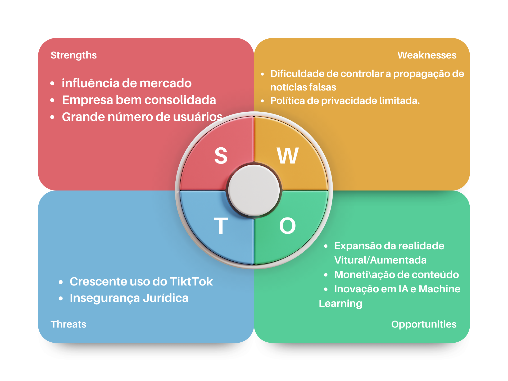

Fonte: Material produzido pelos autores, 2024

<b>Strengths (Forças):</b>

- Sendo uma das maiores plataformas de mídias sociais, a empresa possui mais de 2,8 bilhões de usuários ativos, dando-lhe um alcance enorme.

- A Meta tem grande acesso de dados dos seus usuários, os quais podem ser aproveitados para melhorar seus produtos e serviços.

- É uma empresa consolidada no mercado, tendo a reputação de atrair os melhores talentos e investir no desenvolvimento de funcionários.

- Os algoritmos da Meta estão entre os mais avançados no setor da tecnologia, o que permite o direcionamento de anúncios e proporciona experiências de usuário altamente personalizadas.

- A meta possui diversos fluxos de receita, incluindo publicidade e realidade virtual. Essa diversificação protege a empresa de qualquer fonte de receita única.

<b>Weaknesses (Fraqueza):</b>

- A Meta enfrentou muitas críticas da mídia e do governo americano em relação a sua política de privacidade.

- Dificuldade de controlar e limitar a propagação de informações erradas e notícias falsas.

- Como a empresa depende do envolvimento dos usuários, ela usa táticas para manter esses usuários conectados na plataforma por longos períodos, o que gera preocupação com a saúde mental do público.

- Envolvimento da empresa em escândalos, o que pode afetar sua reputação e a visão do público quanto a sua confiabilidade.

<b>Opportunities (Oportunidades):</b>

- Expansão da Realidade Virtual e Aumentada (VR/AR): A Meta tem enormes investimentos em tecnologias de VR/AR com o Oculus Rift e o Oculus Quest. O cenário global atual oferece oportunidades para expandir essas tecnologias além do entretenimento, incluindo aplicativos para educação, treinamento corporativo, colaboração remota e saúde.

    
 Figura 2 - óculos Virtual 

Fonte: Página do Angus Stevens no LinkedIn[referenciaoculos](#c7), 2023

- Integração de Comércio Eletrônico: Com o crescimento contínuo do comércio eletrônico globalmente, a Meta pode explorar oportunidades para integrar mais recursos de compra e venda diretamente em suas plataformas, oferecendo aos usuários uma experiência de compra mais fluida o que acaba, consequentemente, aumentando sua receita por meio de comissões e publicidade.

- Monetização de Conteúdo: A empresa pode continuar explorando diferentes maneiras de monetizar o conteúdo gerado por usuários em suas plataformas, incluindo modelos de assinatura, publicidade direcionada e transações de conteúdo premium.

- Inovação em Inteligência Artificial e Aprendizado de Máquina: A Meta pode continuar investindo em pesquisa e desenvolvimento em IA e aprendizado de máquina para melhorar a relevância do conteúdo, personalizar experiências do usuário e fornecer ferramentas mais poderosas para os criadores de conteúdo.

- Privacidade e Segurança de Dados: Com as preocupações crescentes com privacidade e segurança de dados, a Meta pode aproveitar a oportunidade para liderar o desenvolvimento de novas tecnologias e práticas que protejam melhor os dados dos usuários e promovam a confiança em suas plataformas.

<b>Threats (Ameaças):</b>

- Concorrência:  Com a crescente do TikTok, o instagram perde a exclusividade e se torna um ponto de ameaça.
    - Manobra feita foi: Criação do reels.

- Recentemente a Meta se envolveu em diversos escândalos (assédio, trafico de pessoas etc.), os quais podem afetar a confiança dos usuários nos serviços da empresa.

### 1.1.3. Descrição da Solução Desenvolvida 

&nbsp;&nbsp;&nbsp;&nbsp;Nosso parceiro enfrentou um desafio devido à falta de uma ferramenta completa que englobe todas as fases do processo de contratação de fornecedores, desde a seleção até o pagamento. Para superar essa questão, propomos uma solução gamificada, implementando um jogo imersivo que apoiará colaboradores e áreas no entendimento do processo de contratação de fornecedores na Meta.

&nbsp;&nbsp;&nbsp;&nbsp;Essa abordagem gamificada incentivará maior participação e interação, utilizando elementos divertidos e desafios para tornar a experiência mais envolvente. Além de educativo, o jogo funcionará como um facilitador para a compreensão de um processo complexo, assegurando que todos os envolvidos tenham uma compreensão clara e possam tomar decisões bem fundamentadas de maneira eficaz."

### 1.1.4. Proposta de Valor 

&nbsp;&nbsp;&nbsp;&nbsp;Value proposition canvas, ou canvas de proposta de valor, é uma ferramenta de análise de público consumidor, que ajuda a entender dores, necessidades e desejos. Essa metodologia baseia a tomada de decisões nos mais diversos níveis e também dá suporte a lançamentos.

&nbsp;&nbsp;&nbsp;&nbsp;A empresa necessita de um jogo que ajude seus colaboradores a entender o processo de contratação de fornecedores, para isso, montamos um canvas de valor com os benefícios do projeto para a Meta e para seus funcionários, além de pensar nos problemas que estão sendo resolvidos e o impacto dessa solução no contexto da empresa.
&nbsp;&nbsp;&nbsp;&nbsp;Um canva de valor avalia o problema a ser resolvido, como fazer isso, as dores do cliente, como aliviar essas dores, e também avaliar o que a empresa e os clientes tem a ganhar com isso.

 

    
 Figura 3 - Canvas de Valor

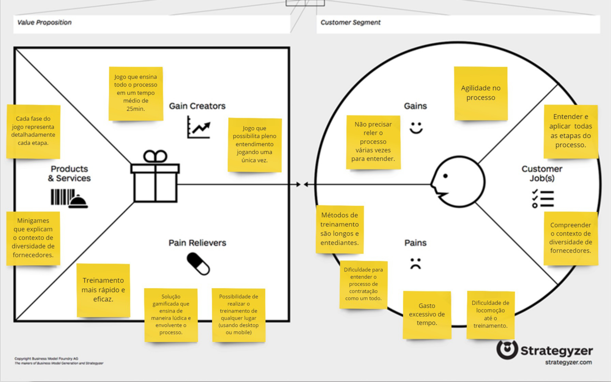

Fonte: imagem de fundo de https://www.strategyzer.com/library/the-value-proposition-canvas  
Fonte:conteúdo produzido pelos autores, 2024 

### 1.1.5. Matriz de Riscos 

&nbsp;&nbsp;&nbsp;&nbsp;A matriz de risco é uma ferramenta utilizada em projetos cuja intenção é avaliar a probabilidade de um evento acontecer e quais seriam os impactos (consequências), ou seja, de que forma ele afetaria o ambiente de trabalho. É importante levar em conta a Matriz de Risco no desenvolvimento de um jogo para se planejar para entrega, se preparando para eventuais problemas, como a correção de bugs ou melhorias solicitadas pelo usuário. Assim, esses problemas se tornam parte do planejamento, evitando atrasos na entrega ou na qualidade do produto.

    
 Figura 4 - Matriz de Risco 1

Fonte: Material produzido pelos autores, 2024

    
 Figura 5 - Matriz de Risco 2

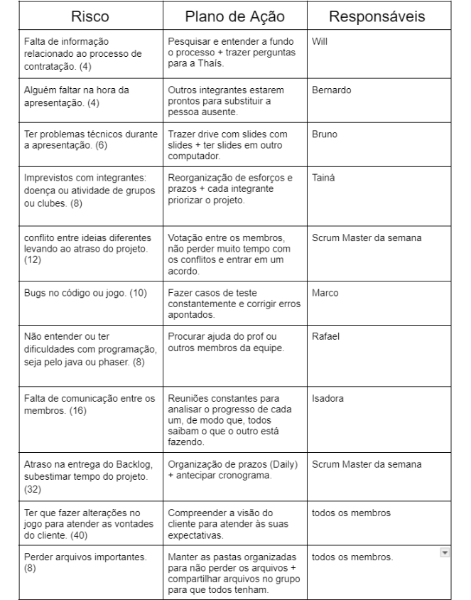

Fonte: Material produzido pelos autores, 2024

    
 Figura 6 - Matriz de Risco 3 

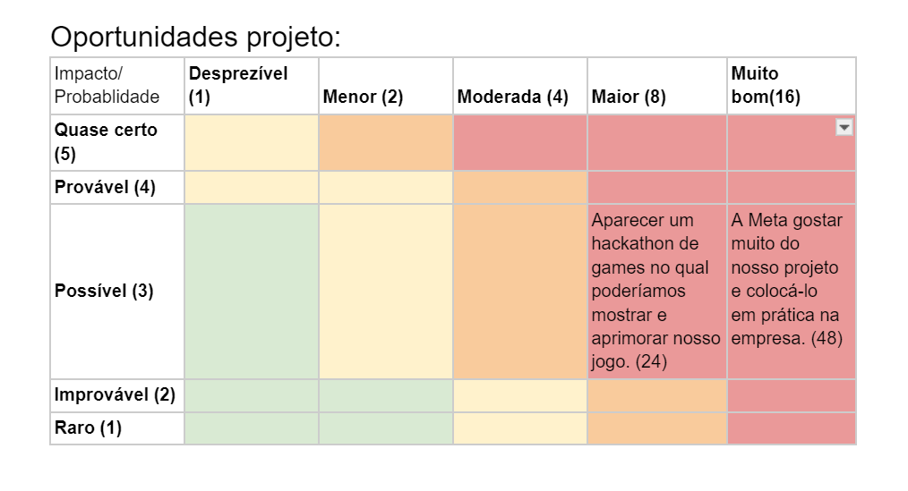

Fonte: Material produzido pelos autores, 2024

## 1.2. Requisitos do Projeto

Requisitos propostos pelo parceiro e membros através de reuniões, na qual o objetivo é exibir uma série de requisitos que contemplam a mecânica, dinâmica e estética do projeto.

\# | Requisito  
--- | ---
1 | O controle do personagem será realizado usando as teclas WASD para navegação pelas fases
2 | O jogo possuirá um mini tutorial instruindo o jogador
3 | O jogo deve possuir uma tela de abertura para o jogador selecionar se quer jogar, ver opções ou os créditos
4 | No jogo vai ter um npc que sempre irá atualizar o jogador com informações do objetivo
5 | Implementar setas do teclado no controle do personagem (atualização após sprint 3)

## 1.3. Público-alvo do Projeto 

&nbsp;&nbsp;&nbsp;&nbsp;O jogo é destinado para todos colaboradores da Meta interessados em desenvolver suas habilidades e realizar contratações de fornecedores pautados no princípio da diversidade de fornecedores.

# 2. Visão Geral do Jogo 

## 2.1. Objetivos do Jogo 

&nbsp;&nbsp;&nbsp;&nbsp;O objetivo do jogo é proporcionar uma simulação prática e cativante das etapas envolvidas na contratação de fornecedores para a empresa Meta. O jogador assume o papel de um colaborador em busca de um entendimento profundo do processo de contratação. O jogo é estruturado em fases, cada uma correspondendo a uma etapa desse processo, permitindo que o jogador entenda o funcionamento e detalhes envolvidos em cada uma delas, finalizando o jogo com o conhecimento necessário para realizar a contratação de fornecedores de acordo com os critérios estabelecidos pela Meta.

## 2.2. Características do Jogo 

### 2.2.1. Gênero do Jogo

&nbsp;&nbsp;&nbsp;&nbsp;Nosso jogo será estilo _RPG Top Down_ no qual o jogador tem o seu personagem, o Tyler, um colaborador recém-contratado da Meta que procura entender melhor o processo de contratação da empresa. Neste jogo, há uma fase para representar cada etapa do processo de contratação. O andamento do jogo se dá por meio da alternancia entre momentos de narração e _minigames_, nos quais o jogador terá que atingir todos os requisitos para conseguir avançar de fase e, por fim, chegar ao fim do jogo. 
&nbsp;&nbsp;&nbsp;&nbsp;Tomamos como inspiração alguns jogos como Pokémon, principalmente [Pokémon FireRed](https://www.nintendo.pt/Jogos/Game-Boy-Advance/Pokemon-FireRed-267123.html) e [Pokémon Ruby](https://www.nintendo.pt/Jogos/Game-Boy-Advance/Pokemon-Ruby-267167.html), e no jogo [The Legend of Zelda: The Minish Cap](https://www.nintendo.pt/Jogos/Game-Boy-Advance/The-Legend-of-Zelda-The-Minish-Cap-267486.html), todos da [Nintendo](https://www.nintendo.pt/).

### 2.2.2. Plataforma do Jogo

&nbsp;&nbsp;&nbsp;&nbsp;Quanto ao dispositivo: desktops e smartphones.

&nbsp;&nbsp;&nbsp;&nbsp;quanto ao sistema: Web e mobile.

### 2.2.3. Número de jogadores

&nbsp;&nbsp;&nbsp;&nbsp;O jogo foi pensado e desenvolvido para apenas um jogador.

### 2.2.4. Títulos semelhantes e inspirações 

&nbsp;&nbsp;&nbsp;&nbsp;Como supracitado no item 2.2.1, tivemos diversas inspirações durante o desenvolvimento. Quanto ao estilo, um rpg top down, tomamos como base jogos da franquia Pokémon, principalmente [Pokémon FireRed](https://www.nintendo.pt/Jogos/Game-Boy-Advance/Pokemon-FireRed-267123.html) e [Pokémon Ruby](https://www.nintendo.pt/Jogos/Game-Boy-Advance/Pokemon-Ruby-267167.html), e no jogo [The Legend of Zelda: The Minish Cap](https://www.nintendo.pt/Jogos/Game-Boy-Advance/The-Legend-of-Zelda-The-Minish-Cap-267486.html), todos da [Nintendo](https://www.nintendo.pt/).
Também temos um design baseado na [Twilight Forest](https://www.curseforge.com/minecraft/mc-mods/the-twilight-forest),um mod de [Minecraft](https://www.minecraft.net/pt-br) que mistura diversos elementos fantásticos, como fadas e castelos, porém apresentando-os com um clima mais misterioso e sombrio.

### 2.2.5. Tempo estimado de jogo 

&nbsp;&nbsp;&nbsp;&nbsp;O jogo pode ser concluído em até 20 minutos. O tempo final do jogo depende do jogador, visto que, só é possível avançar no jogo completando as fases corretamente, tendo de repeti-las em outro caso.  

# 3. Game Design 

## 3.1. Enredo do Jogo 
&nbsp;&nbsp;&nbsp;&nbsp;Tyler, o protagonista do jogo, é um novo colaborador da Meta. Como novo colaborador, ele precisa passar pelo treinamento que vai capacitá-lo a contratar fornecedores "aos moldes Meta de contratação". Nesse processo de treinamento, Tyler irá receber a ajuda da Vanessa, uma colaboradora do time de _Diversity Supply_ que testará, juntamente com a Equipe de Inovação, um novo treinamento que se utiliza de tecnologias de realidade virtual para ensinar todo o processo de contratação de fornecedores em um mundo fictício dentro do _metaverso_.  
&nbsp;&nbsp;&nbsp;&nbsp;Assim, Tyler embarca em uma aventura em um universo fantástico com a missão de ajudar um rei a se preparar para enfrentar um grande mal que se aproxima do reino auxiliando-o a fazer alianças com poderosos generais, como a Celeste, a Aysla, o Romeo e o Gizmo. Aqui, o reino e o próprio rei são uma metáfora a Meta, com o reino possuindo os valores da empresa e seguindo um processo de formação de alianças que é uma paráfrase do processo de contratação de fornecedores da Meta, enquanto os generais e seus exércitos personificam os fornecedores.

## 3.2. Personagens

### 3.2.1. Controláveis
 
&nbsp;&nbsp;&nbsp;&nbsp;Em nosso jogo existe apenas um personagem controlado pelo jogador, o Tyler. Ele representa um novo colaborador da Meta e sua missão é compreender plenamente o processo de contratação de fornecedores, buscando sempre fazer escolhas que respeitem o principal princípio da empresa: a diversidade. Visando fortalecer a rede de fornecedores de forma inclusiva, Tyler enfrenta desafios que exigem discernimento e sensibilidade cultural, em que suas escolhas influenciam não apenas o sucesso da empresa, mas também seu compromisso com a promoção e valorização da diversidade de fornecedores e justiça social.

 Figura 7 - Tyler

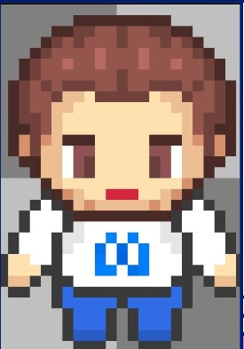

Fonte: Material produzido pelos autores, 2024

 Figura 8 - Tyler com armadura

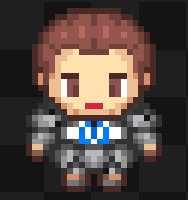

Fonte: Material produzido pelos autores, 2024

### 3.2.2. Non-Playable Characters (NPC)

&nbsp;&nbsp;&nbsp;&nbsp;Como mencionado no item 3.2.1, a diversidade de fornecedores é essencial para empresa Meta. Desse modo, buscamos desenvolver _NPCs_ que representem essa diversidade e inclusão, a fim de promover a igualdade de oportunidades. Cada um desses _NPCs_ traz consigo características e experiências únicas, são eles:                                             

Celeste: Uma Elfa com traços afrodescendente que representa a população feminina e negra.                                                    

 Figura 9 - Celeste

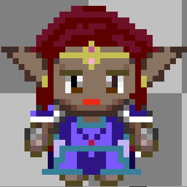

Fonte: Material produzido pelos autores, 2024

Aysla: Uma druida portadora de albinismo, representando a diversidade em suas múltiplas formas.

 Figura 10 - Aysla

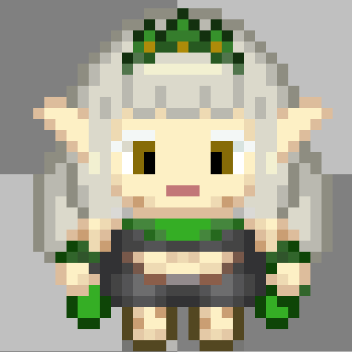

Fonte: Material produzido pelos autores, 2024

Romeo: Um mago com deficiência visual, cuja presença destaca a importância da inclusão de pessoas com deficiência.

 Figura 11 - Romeo

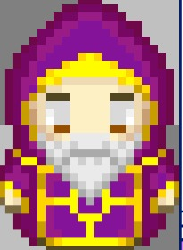

Fonte: Material produzido pelos autores, 2024

Gizmo: Um arqueiro com deficiência física, cuja habilidade e determinação desafiam qualquer tipo de estereótipo.

 Figura 12 - Gizmo

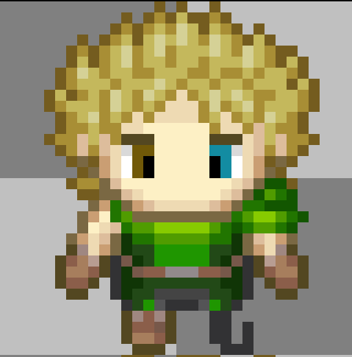

Fonte: Material produzido pelos autores, 2024

Vanessa: Uma mulher em posição de destaque na empresa, um símbolo de progresso e igualdade de gênero. Seu papel no jogo é mostrar que as mulheres podem ocupar cargos de liderança com excelência.

 Figura 13 - Vanessa

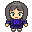

Fonte: Material produzido pelos autores, 2024

Rei: Um monarca com traços afrodescendente, ele ocupa o mais alto escalão da realeza, desafiando estereótipos enraizados sobre a predominância da pele branca na monarquia.

 Figura 14 - Rei

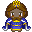

Fonte: Material produzido pelos autores, 2024

### 3.2.3. Diversidade e Representatividade dos Personagens
&nbsp;&nbsp;&nbsp;&nbsp;Dentro o nosso jogo, temos como representação de fornecedores personagens com características diversas, como:

- Gizmo: personagem que utiliza uma prótese na sua perna esquerda. Através dele buscamos mostrar que, independente de qualquer condição física, pessoas com deficiência são capazes de desempenhar suas funções com excelência.  

- Romeo: um mago com deficiência visual. Ele é capaz de se orientar através do som do ambiente e da leitura de energias. Nosso objetivo com esse general (fornecedor) é muito semelhante ao objetivo que temos com o Gizmo: mostrar que pessoas com deficiência são plenamente capazes de desempenhar suas funções.

- Aysla: uma druida amante da fauna e da flora e que tem uma condição de ausência de melanina. Por meio dessa personagem, também almejamos trazer aspectos da responsabilidade ambiental e cuidado com os recursos naturais.

- Celeste: uma elfa com traços afrodescendentes, representando a população feminina e preta. A personagem também se constitui de um símbolo de poder e pureza através de uma posição celestial e espirituosa, possuindo uma posição de destaque no contexto do jogo. Assim, procura-se desassociar qualquer pensamento preconceituoso e obsoleto referente a pessoas de pele preta e a sua posição dentro da sociedade. 

## 3.3. Mundo do jogo 

### 3.3.1. Locações Principais e/ou Mapas 
&nbsp;&nbsp;&nbsp;&nbsp;Este é o mapa inicial, uma avenida onde está o escritório da Meta. Como primeiro mapa do jogo, espera-se que aqui o jogador aprenda os comandos de movimentação do personagem enquanto segue para o interior do edifício da Meta.

 Figura 15 - Mapa Inicial

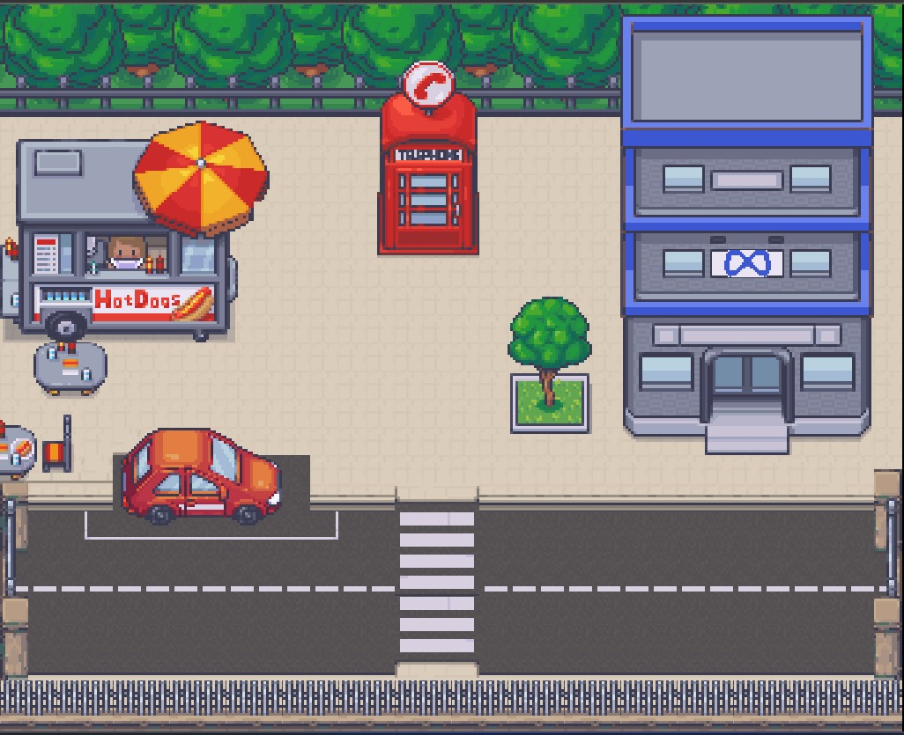

Fonte: Material produzido pelos autores, 2024

&nbsp;&nbsp;&nbsp;&nbsp;Por sua vez, tem-se aqui a sala na qual o protagonista deverá usar o _Meta Quest_ e entrar no Metaverso.

 Figura 16 - Escritório

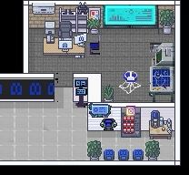

Fonte: Material produzido pelos autores, 2024

&nbsp;&nbsp;&nbsp;&nbsp;Neste momento, tem-se uma parcela do mapa referente ao Metaverso: uma floresta onde o Tyler iniciará sua aventura nesse novo mundo.

 Figura 17 - Floresta

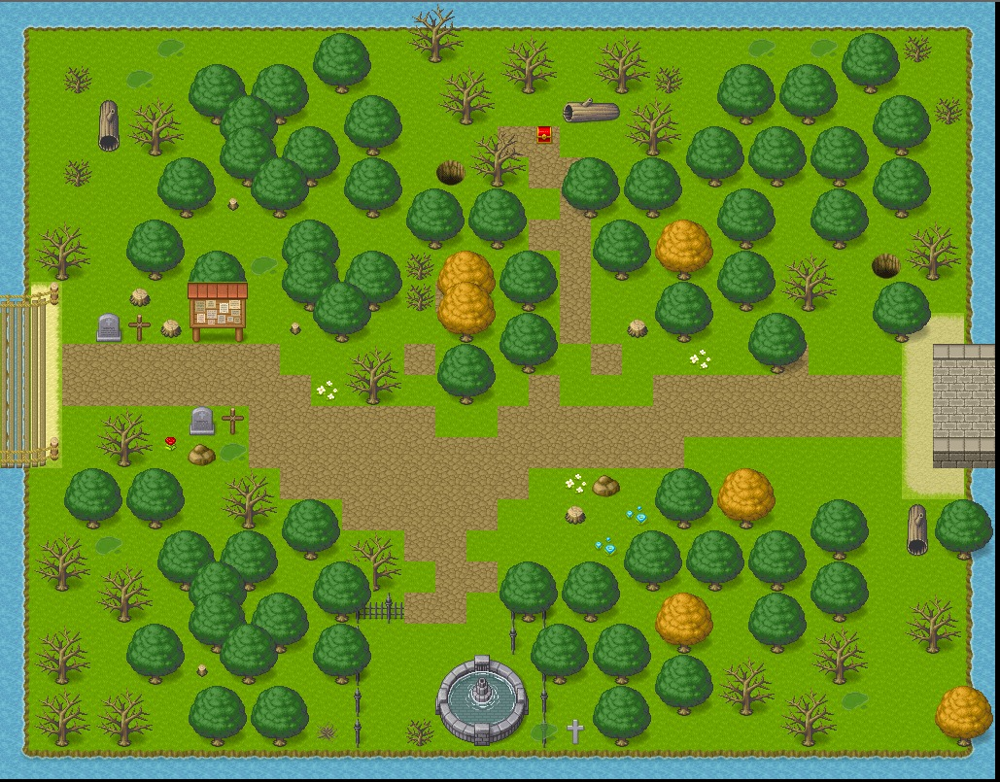

Fonte: Material produzido pelos autores, 2024

    
&nbsp;&nbsp;&nbsp;&nbsp;Além disso, há também um cenário que representa o interior do castelo do rei. Aqui, o Tyler deve se locomover até o salão real (ainda me desenvolvimento), onde o rei o aguarda.

 Figura 18 - Castelo

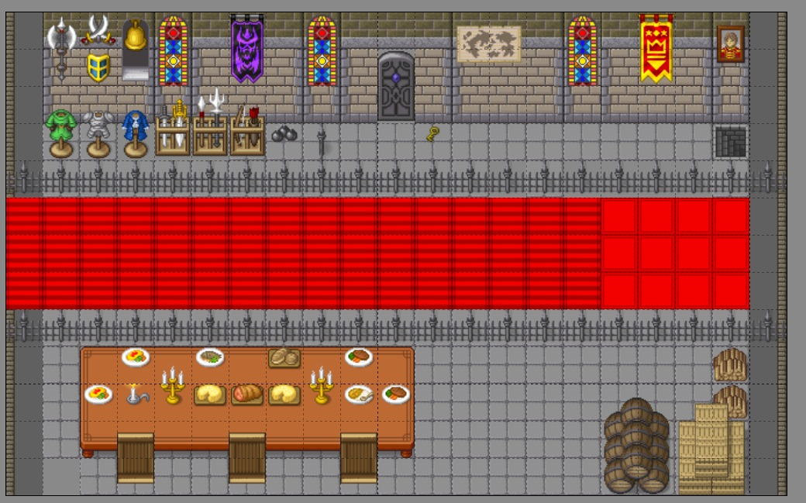

Fonte: Material produzido pelos autores, 2024

### 3.3.2. Navegação pelo mundo 

3.3.2. Exploração do Mundo

1. Configurações Iniciais:
   - Na tela inicial, o jogador seleciona o idioma desejado (inglês ou português). Em seguida, encontra a opção "Jogar" para iniciar efetivamente o jogo.

2. Controles do Personagem:
   - Utilizando os seguintes controles:
     - W: Movimento para cima
     - S: Movimento para baixo
     - A: Movimento para a esquerda
     - D: Movimento para a direita

3. Segunda Cena: Rua
   - Ao clicar em " Play", o personagem controlável, Tyler, é posicionado para a segunda cena, localizada na rua em frente ao prédio da Meta. O jogador utiliza os controles para guiar Tyler até a empresa Meta, situada no canto direito da tela.

4. Terceira Cena: Interior da Meta
   - Ao deslocar-se até a porta do prédio da Meta, o personagem é enviado para a terceira cena. Nesta cena, Tyler encontra Vanessa, que fornece as devidas instruções e o encaminha para os óculos de realidade virtual, os quais o levarão para o metaverso (onde ocorre a quarta cena).

5. Quarta Cena: Floresta (Metaverso):
   - Ao concluir a terceira cena, o jogador é enviado para uma floresta, onde Tyler encontra um _NPC_ que oferece orientações sobre a jornada e o direciona para a próxima cena.

6.  Quinta cena: Transição entre Floresta e Castelo:
   - Ao atravessar uma ponte no final da floresta, Tyler entra na quinta cena, um jardim em frente ao castelo. Um novo _NPC_ orientador direciona Tyler ao _Castelo do Rei_.

7. Sexta cena: Castelo
   - Ao adentrar o castelo, Tyler é inserido na sexta cena, situada no corredor que o conduz até a _Sala do Rei_.

8.  Sétima cena:  Sala do Rei
   - Na sétima cena, localizada na sala do trono do rei, Tyler recebe instruções acerca da continuidade e história do jogo.

9. Próximos Passos em Desenvolvimento:

   - Correção de _bugs_ nos mapas do jogo;
   - Criação do _Sala da Escriba_, cenário no qual ocorrerão alguns dos _minigames_;
   - Melhora na usabilidade e no ensino sobre as mecânicas de movimentação do persongem para o jogador;
   - Ajuste dos diálogos;

### 3.3.3. Condições climáticas e temporais

Em nosso jogo, não há condições climáticas ou temporais.

### 3.3.4. Concept Art
_Concept Art_, "Arte conceitual" em tradução livre, diz respeito a uma série de ilustrações, desenhos, rascunhos ou outras formas de arte que tem como objetivo ilustrar a ideia de algum elemento de uma obra, como o design de um personagem, objeto, cenário, criatura etc.[[referenciaconceptart1]](#7-referências) [[referenciaconceptart2]](#7-referências)

Nesse sentido, foram desenvolvidas _concept arts_ para que pudéssemos visualizar algumas de nossas ideias de personagens, _minigames_ e cenários. Segue algumas delas:

 Figura N: Concept art da Sala do Trono
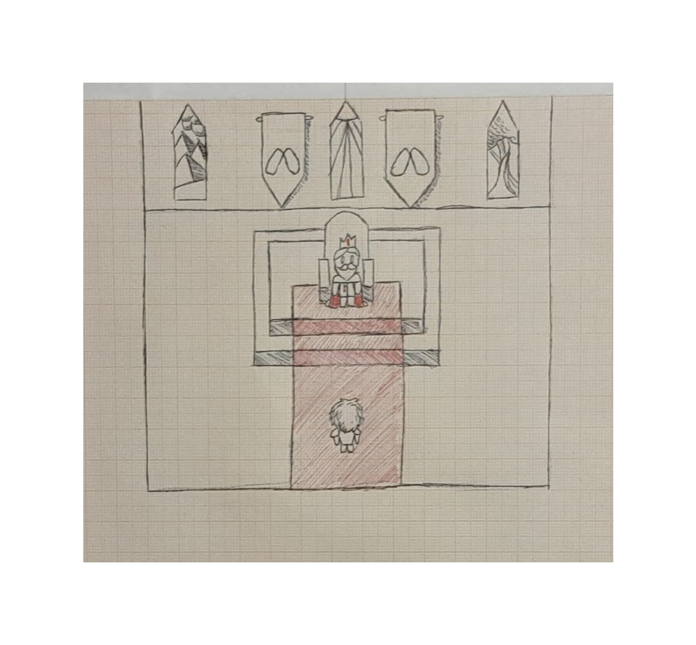

Fonte: Material produzido pelos autores, 2024

 Figura 22 - Concept art do _minigame_ 1   

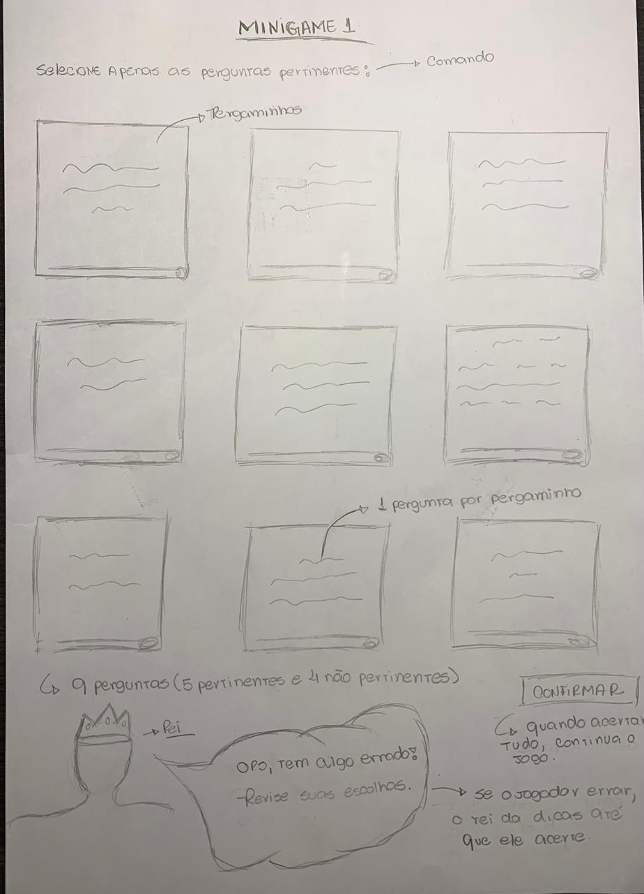

Fonte: Material produzido pelos autores, 2024

 Figura N - Concept art do pergaminho de perfis do _minigame_ 2 

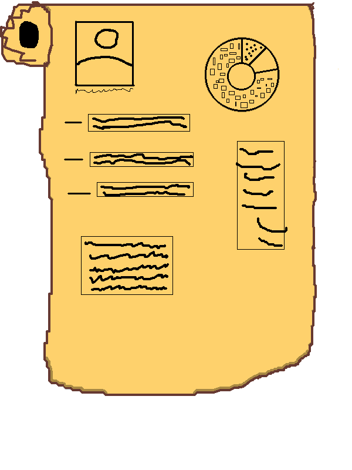

Fonte: Material produzido pelos autores, 2024

### 3.3.5. Trilha sonora 

A trilha sonora e sonoplastia do jogo foi feita através de áudios disponibilizados no banco de mídia [Pixabay](https://pixabay.com/pt/). Todos os áudios podem ser utilizados para qualquer fim sem a necessidade de referenciação ou citação do autor.O objetivo da trilha sonora aumentar a imersão do jogador no jogo, criando uma nova camada sonora que complementa os elementos visuais. Para além da trilha sonora, também foram outros sons (como sons de passos, pássaros e portas) para contribuir com o realismo e verosimilhança da cena.

\# | titulo | ocorrência | autoria
--- | --- | --- | ---
1 | passosConcreto | Personagem andando no chão de concreto | Pixabay
2 | passos | Personagem andando na terra |Pixabay
3 | predioAudio | Cena em frente ao prédio |Pixabay
4 | passaros | Cena na natureza |Pixabay
5 | oceano | Cena na ponte |Pixabay
6 | musicaRei | Cena no castelo e adiante |Pixabay

## 3.4. Inventário e Bestiário

### 3.4.1. Inventário

Não há intens especiais ou inventário em nosso jogo.

### 3.4.2. Bestiário

Não há inimigos em nosso jogo.

## 3.5. Gameflow (Diagrama de cenas)

[Gameflow (diagrama de cenas)](https://www.figma.com/file/pAGJO8K0EiS1LBVF8aQPS8/Storyboard-de-programa%C3%A7%C3%A3o-(Diagrama-de-cenas)?type=whiteboard&t=596Q4PORtJdAKPrV-1) das duas telas inciais do jogo.

 figura 23 - 

Fonte: Material produzido pelos autores, 2024

## 3.6. Regras do jogo

&nbsp;&nbsp;&nbsp;&nbsp;O objetivo principal do jogador é entrar em uma jornada para compreender o processo de contratação da Meta, guiado por etapas estruturadas no jogo. No decorrer das etapas, o rei assume o papel de instrutor e passa informações importantes sobre o processo de contratação, além de direcionar Tyler para _minigames_ que precisam ser realizados corretamente para que o jogo continue.

**Etapa 1:**  
   
   **_Minigame_ 1:** 
   &nbsp;&nbsp;&nbsp;&nbsp;Ocorre após as instruções iniciais do rei. Nesse _minigame_, são apresentadas diversas perguntas, sendo algumas pertinentes para serem feitas aos potenciais fornecedores e outras não. A tarefa do jogador consiste em selecionar as perguntas corretas para avançar à próxima fase. Caso seja escolhida alguma pergunta errada, o rei oferece uma dica para orientar a Tyler, possibilitando que o jogador tente novamente.

   **_Minigame_ 2:**  
   &nbsp;&nbsp;&nbsp;&nbsp; Ocorre após o _Minigame_ 1. Nesse momento, Tyler deve analisar pergaminhos enviado pelos generais que contém informações sobre os seus exércitos, como características dos guerreiros, últimas atividades desse exército e dados sobre os próprios líderes dessas tropas. O objetivo é que o jogador escolha, baseado na premissa da _Diversidade de Fornecedores_, exércitos (metáfora para os fornecedores dentro da história) mais adequados para concluir o jogo. Em caso de erros, o rei oferecerá dicas para que o jogador tente novamente até fazer as escolhas corretas.

**Etapa 2:**

&nbsp;&nbsp;&nbsp;&nbsp; Tyler deve entregar suas respostas no _Minigame_ 2 ao rei, permitindo que este avalie e emite sua análise sobre as escolhas do jogador. Esta fase faz referência a validação pela qual os fornecedores passam antes de serem cadastrados nos sistemas da Meta.

&nbsp;&nbsp;&nbsp;&nbsp;Nas etapas seguintes (3,4,5,6,7) o rei explica em detalhes o que ocorre em cada fase do processo de contratação. Tyler também passará por mais 1 _minigame_, no qual ele deverá discutir as condições de trabalho dos fornecedores e acordar os valores a serem pagos a cada um deles. O jogador acompanha as explicações do rei para compreender o funcionamento de cada parte do processo de contratação da Meta. O desfecho do jogo ocorre quando o usuário conclui cada _minigame_ e supera todas as fases.

## 3.7. Mecânicas do jogo

&nbsp;&nbsp;&nbsp;&nbsp;O jogo tem um personagem principal que é movimentado através das teclas "WASD". Ele é livre para percorrer todo o mapa, possuindo algumas barreiras que o impossibilitam de acessar certas regiões. Além das teclas de movimento, existe a tecla "E", responsável pela interação entre o personagem e alguns _NPCs_ e elementos do cenário. Ademais há a possibilidade de jogar com um _joystick_ no lugar de usar o teclado. 
&nbsp;&nbsp;&nbsp;&nbsp;O jogo possui _minigames_ de escolha, nos quais o jogador deve selecionar, através de cliques, dentre as opções apresentadas na tela as que julgar corretas. No _minigame_ 1, por exemplo, existem perguntas a serem selecionadas para a formação do RFP, sendo a fase concluída após a escolha das alternativas corretas. Após isso, tem-se o _minigame_ 2, cujo objetivo é que o jogador aceite ou recuse os fornecedores com base no perfil deles, tendo a seleção feita por meio de clique no mouse. Em dispositivos móveis, o sistema de cliques com mouse é feita por meio de cliques na tela.

# 4. Desenvolvimento do Jogo

## 4.1. Desenvolvimento preliminar do jogo

&nbsp;&nbsp;&nbsp;&nbsp;Nosso personagem principal, o Tyler Calvin, inicia sua jornada em uma rua. O Tyler segue sua trilha e entra em uma nova cena, onde ele encontra a Vanessa, que vai auxiliá-lo no treinamento de contratação de novos fornecedores.

&nbsp;&nbsp;&nbsp;&nbsp;Para começar nosso projeto criamos a _spritesheet_ de movimento do nosso personagem, também selecionamos duas cenas de fundo e aplicamos as barreiras para o personagem não abandonar o cenário do jogo. Utilizamos-nos dos conhecimentos das aulas de programação para movimentar o personagem e estudamos por outras fontes como criar múltiplas cenas e, também, como controlá-lo através do teclado.

 Figura 24 - Cena inicial

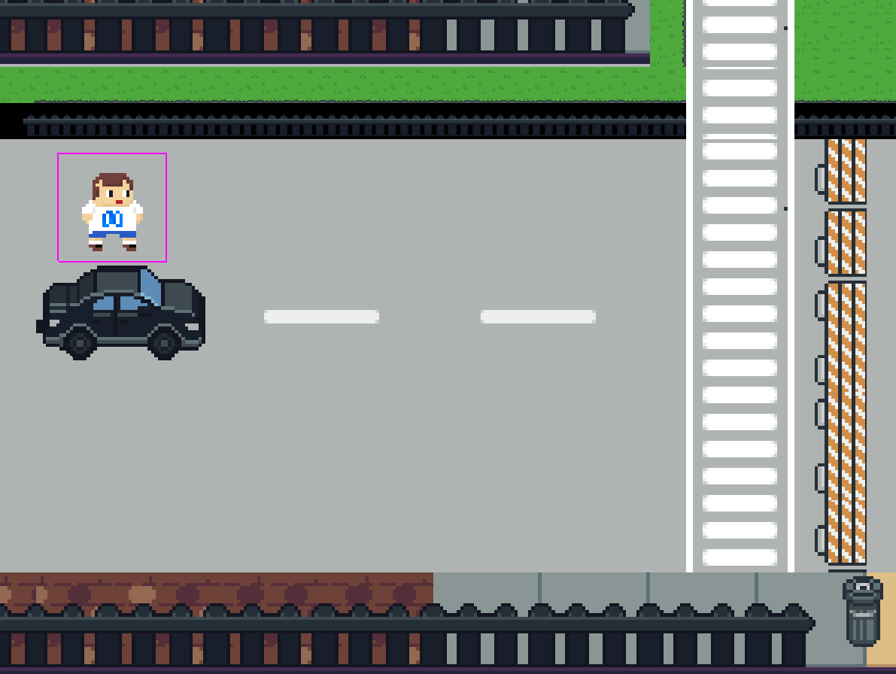

Fonte: Material produzido pelos autores, 2024

 Figura 25 - Encontro com a Vanessa

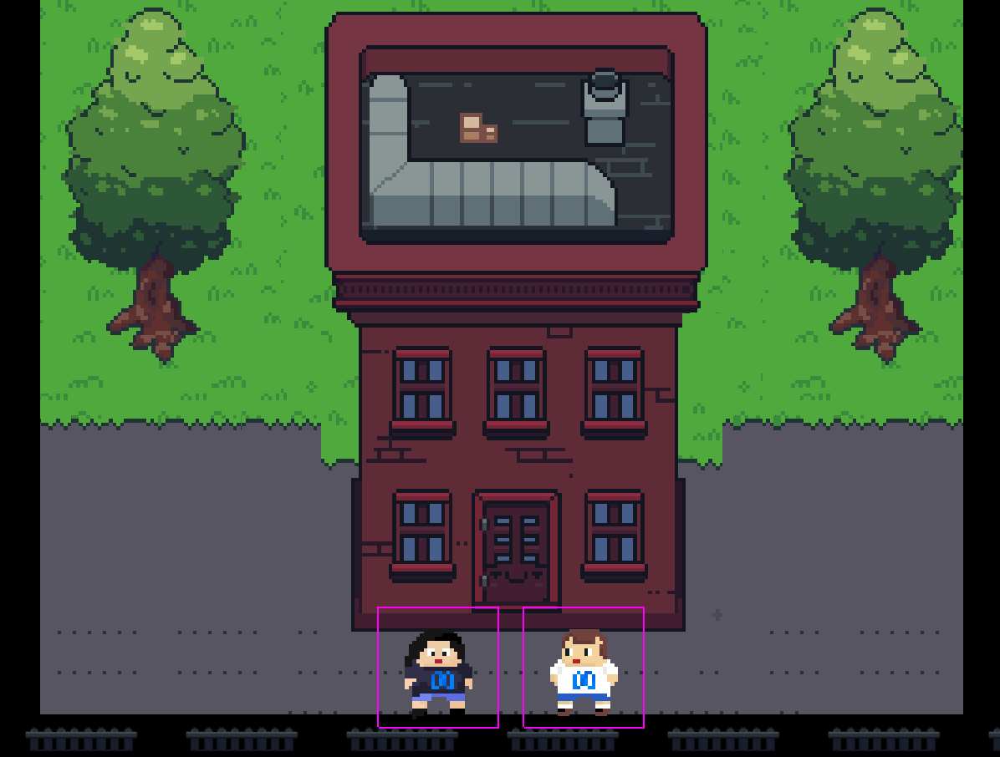

Fonte: Material produzido pelos autores, 2024

&nbsp;&nbsp;&nbsp;&nbsp;O único desafio enfrentado foi a mudança de cenas, contudo essa questão foi resolvida através de conteúdos online e aulas da "Semana 4". Assim, conseguimos implementar essa mecânica dentro do nosso primeiro protótipo.

&nbsp;&nbsp;&nbsp;&nbsp;Existem alguns passos que queremos aplicar no futuro, alguns deles são:
- Desenvolver mais personagens, sempre buscando diversidade.
- Estabelecer os estilos do jogo.
- Focar na usabilidade e portabilidade, fazendo com que o jogo possa ser utilizado pelo maior número de colaboradores possível.
- Manter um desenvolvimento próximo à Meta com o objetivo de alinhar expectativas com um processo constante de produção e feedbacks.
- Desenvolvimento completo da história e das mecânicas que vão tornar nosso jogo único!
- Criar uma trilha sonora para o game.

## 4.2. Desenvolvimento básico do jogo 

&nbsp;&nbsp;&nbsp;&nbsp;O projeto é desenvolvido em JavaScript com o uso do _FrameWork_ Phaser, com ele é possível controlar diversas funções utilizadas ao decorrer do código, como a função que controla o personagem ou a que aciona o botão da tela inicial quando clicado.

&nbsp;&nbsp;&nbsp;&nbsp;O jogo começa em uma tela que possui alguns botões, através do código implementamos funções que aumentam o tamanho deles quando o mouse estiver sobre eles. Além disso, o botão de play já está funcional e é responsável por chamar a classe _MainScene_, que é onde a primeira fase do jogo está armazenada.

    
 Figura 26 - Tela Inicial

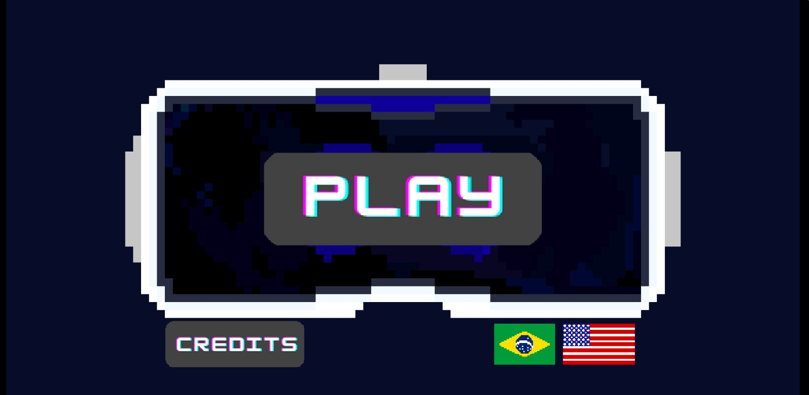

Fonte: Material produzido pelos autores, 2024

&nbsp;&nbsp;&nbsp;&nbsp;A classe _MainScene_, assim como as outras cenas do jogo, chama algumas classes secundárias, que são responsáveis por armazenar partes especificas do jogo, como o código responsável pela animação, os controles, entre outros. Esses códigos armazenam funções que serão utilizadas mais de uma vez ao decorrer do jogo, por esse motivo, eles são armazenados separadamente, com o intuito de organizar e facilitar a reutilização de códigos.

 Figura 27 - Controle

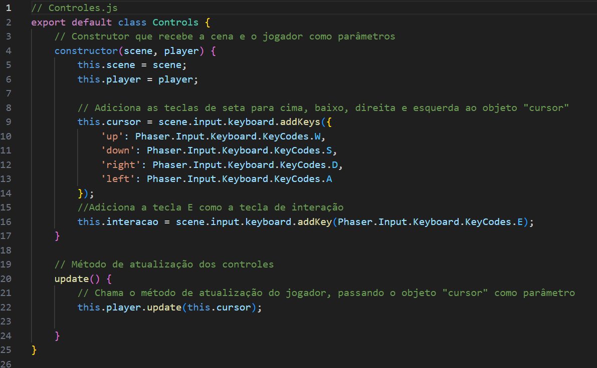

Fonte: Material produzido pelos autores, 2024

 Figura 28 - MainScene

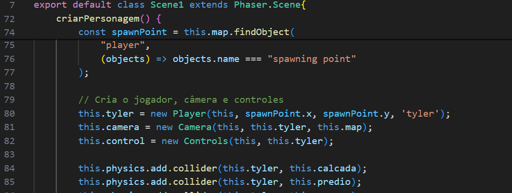

Fonte: Material produzido pelos autores, 2024

&nbsp;&nbsp;&nbsp;&nbsp;Voltando para a _MainScene_, o personagem começa em uma rua em frente ao prédio da Meta, e deve seguir até a porta de entrada. Lá o Tyler terá acesso ao predio através do teclado, já que configuramos que a troca de cena acontece quando o jogador apertar a tecla "E", mecânica que se repetirá ao longo do jogo, nas interações com _NPCs_ e com o cenário.

 Figura 29 - Prédio da Meta

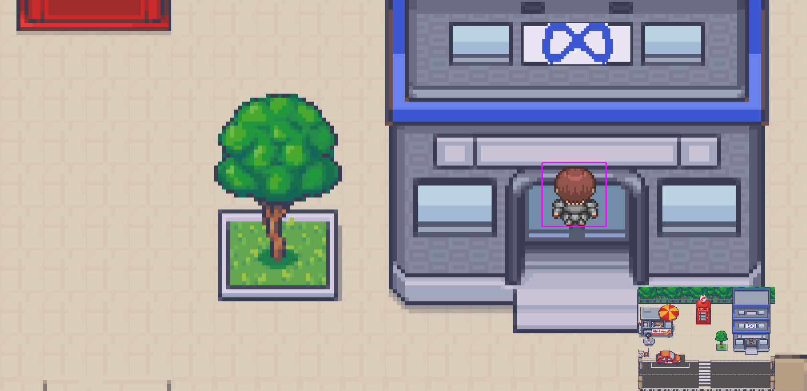

Fonte: Material produzido pelos autores, 2024

&nbsp;&nbsp;&nbsp;&nbsp;A ideia em desenvolvimento é que o personagem encontrará a _NPC_ Vanessa dentro da Meta e ela o ajudará nessa jornada. No interior do prédio, através do editor de cenários [Tyled](https://www.mapeditor.org/), implementamos as barreiras na qual o personagem vai esbarrar, impedindo-o de atingir determinados pontos do mapa. Essas barreiras estarão por todo o mapa do jogo, impedindo que o jogador atravesse objetos no jogo.

 Figura 30 - Interior do castelo

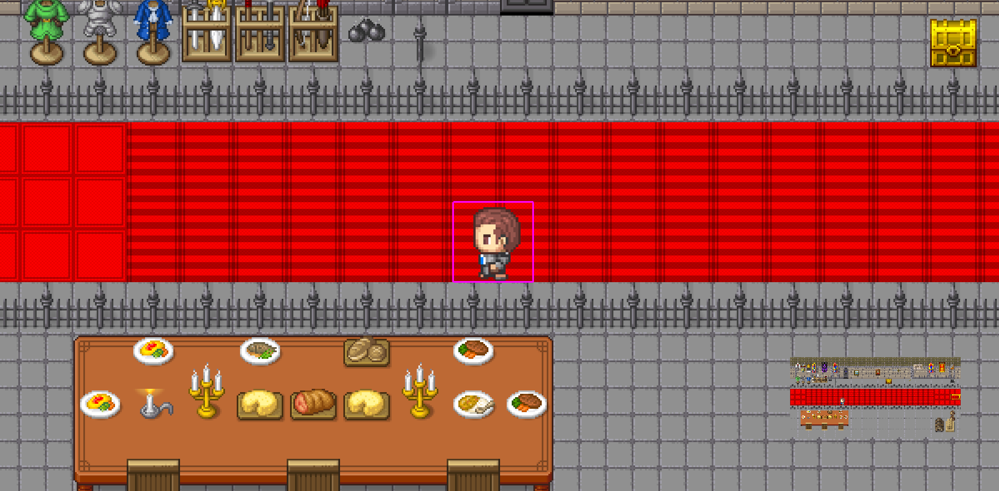

Fonte: Material produzido pelos autores, 2024

&nbsp;&nbsp;&nbsp;&nbsp;Voltando ao que já foi desenvolvido, tem-se o mapa em que o personagem atravessa uma floresta e chega em um castelo. Tudo isso acontece com as mesmas mecânicas anteriores, com colisões e interações ao longo da jornada.

 Figura 31 - Colisão com árvores e Vanessa

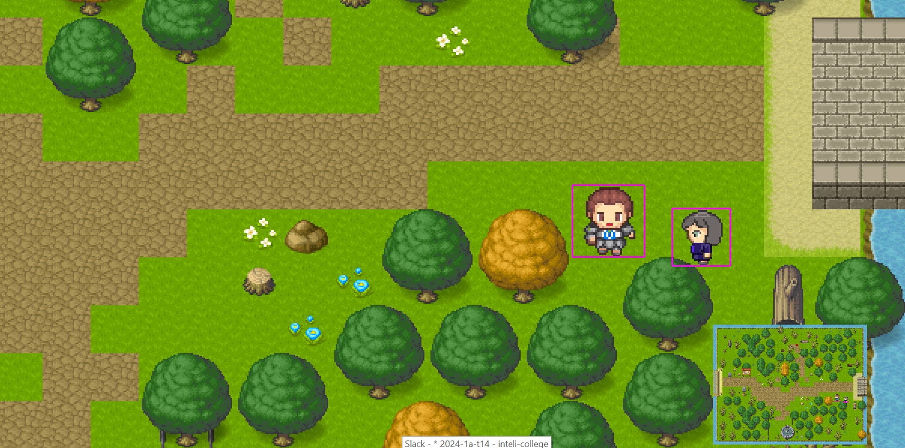

Fonte: Material produzido pelos autores, 2024

&nbsp;&nbsp;&nbsp;&nbsp;A maior dificuldade foi o conteúdo. Em diversos queríamos implementar algo que ninguém do grupo sabia exatamente como, e a busca pela resposta foi muitas vezes trabalhosa, foi possível, entretanto, que colocássemos nossas ideias em prática por meio de pesquisas individuais.
&nbsp;&nbsp;&nbsp;&nbsp;Até o final da entrega almejamos construir todas as nossas cenas de forma funcional, incluir os _minigames_ que estão planejados no momento e adaptar o jogo para dispositivos móveis.

## 4.3. Desenvolvimento intermediário do jogo 

&nbsp;&nbsp;&nbsp;&nbsp;Na sprint 2 já existia uma ideia muito concreta das metas que queríamos entregar, por isso, durante a sprint 3 poucas fatores foram modificados, mas muitas elementos implementadas.
&nbsp;&nbsp;&nbsp;&nbsp;O design do castelo foi alterado com a intenção de passar a ideia de um castelo da Meta, por isso, a cor azul ganhou destaque na cena. Também mudamos o cenário de integração entre a floresta e o castelo, para aumentar a dinamicidade da passagem entre as cenas.

 Figura 32 - Castelo Novo

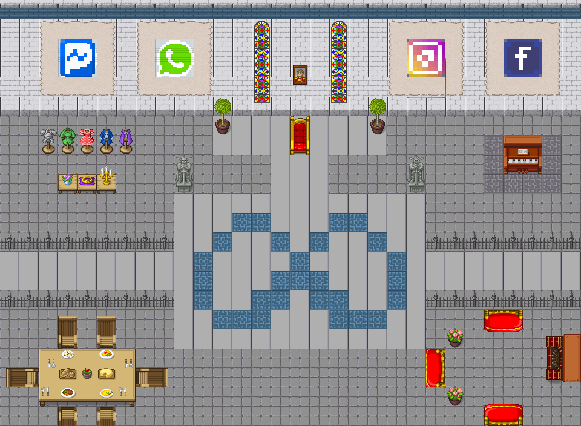

Fonte: Material produzido pelos autores, 2024

 Figura 33 - Exterior do castelo 

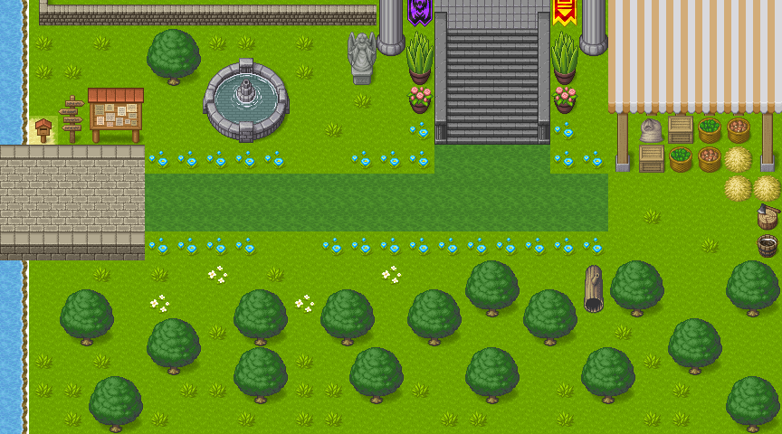

Fonte: Material produzido pelos autores, 2024

&nbsp;&nbsp;&nbsp;&nbsp;O jogo agora conta com a cena do escritório, onde o jogador encontrará a Vanessa e terá toda a instrução necessária para iniciar o jogo. Também temos a sala do escriba, um novo cenário.

 Figura 34 - Sala de escritório 

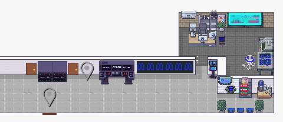

Fonte: Material produzido pelos autores, 2024

 Figura 35 - Sala do escriba 

Fonte: Material produzido pelos autores, 2024

&nbsp;&nbsp;&nbsp;&nbsp;A principal alteração do nosso jogo foi a implementação dos diálogos entre o Tyler e o rei, nos quais são explicados o processo de contratação e dois _minigames_ que vão testar se o jogador está entendendo o processo.

 Figura 36 - Conversa com rei 

Fonte: Material produzido pelos autores, 2024

&nbsp;&nbsp;&nbsp;&nbsp;O rei explicará a etapa de _Sourcing_ e o jogador, através de um _minigame_ de escolhas, deverá escolher as melhores perguntas a serem enviadas aos futuros parceiros. Após concluir essa etapa, o jogador lerá a resposta das empresas e escolherá as melhores opções para prosseguir no processo de contratação.

 Figura 37 - Minigame 1 

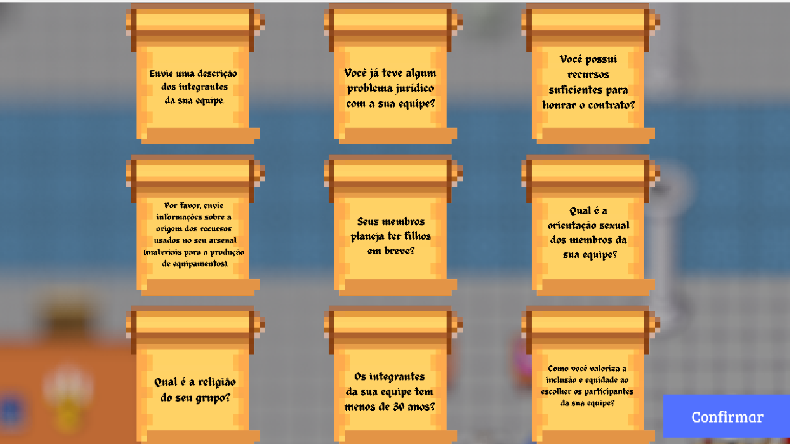

Fonte: Material produzido pelos autores, 2024

 Figura 38 - Minigame 2 

Fonte: Material produzido pelos autores, 2024

&nbsp;&nbsp;&nbsp;&nbsp;Os minigames foram feitos usando os conhecimentos adquiridos nas últimas semanas. No _minigame_ 1, em síntese, o jogador deve escolher dentre algumas opções de perguntas, aquelas que mais se adéquem para constar no RFP. Já o _minigame_ 2, o jogador deve selecionar os fornecedores que sejam mais compatíveis com os princípios da Meta.  
&nbsp;&nbsp;&nbsp;&nbsp;O objetivo para as próximas semanas é a implementação do idioma inglês e a continuação do processo de contratação, visando que ainda não o explicamos completamente.

## 4.4. Desenvolvimento final do MVP
&nbsp;&nbsp;&nbsp;&nbsp;Na sprint 4, nosso jogo ganhou muito mais interações com NPC's, agora, todo o processo de contratação é explicado pelos diálogos ao longo do jogo. Também foi adicionado um novo e último minigame, o minigame da negociação. Além disso, alguns cenários foram melhorados, trazendo um melhor aspecto visual ao jogador.

&nbsp;&nbsp;&nbsp;&nbsp;Tudo começa na tela inicial. O jogador tem a opção funcional de escolher em qual idioma quer jogar (português ou inglês)

 Figura 39 - Idiomas na Tela inicial

Fonte: Material produzido pelos autores, 2024

&nbsp;&nbsp;&nbsp;&nbsp;Quando o jogo começa, temos assets que auxiliam o jogador a jogar, ensinando-o como se locomover e o que deve ser feito.

 Figura 40 - Tutorial básico do jogo 

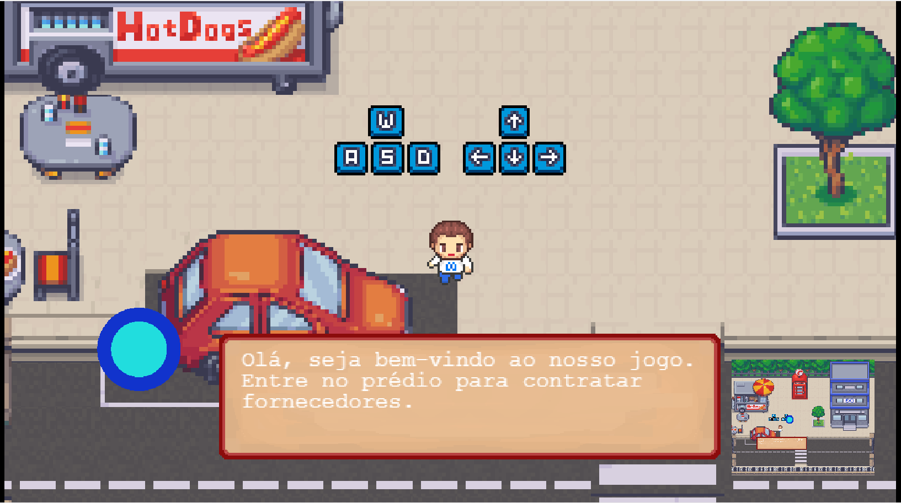

Fonte: Material produzido pelos autores, 2024

&nbsp;&nbsp;&nbsp;&nbsp;Anteriormente, tinhamos duas cenas para representar uma floresta e o exterior do castelo. Decidimos juntá-las e fazer uma cena mais lógica com a proposta do nosso jogo. Essa junção também melhora a experiência do usuário, já que está muito mais interessante visualmente

 Figura 41 - Novo exterior do castelo 

Fonte: Material produzido pelos autores, 2024

&nbsp;&nbsp;&nbsp;&nbsp;O castelo foi dividido em duas partes, o corredor e a sala do rei. O jogador atravessa o corredor, onde ele pode interagir com NPC's, até chegar ao rei, onde se inicia toda a aventura.

 Figura 42 - Corredor do castelo 

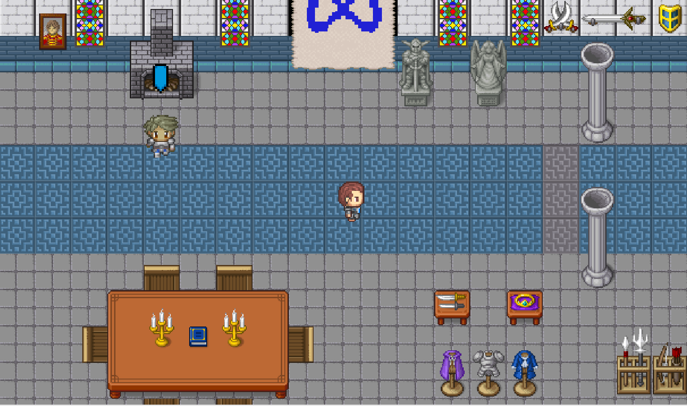

Fonte: Material produzido pelos autores, 2024

 Figura 43 - Sala do rei 

Fonte: Material produzido pelos autores, 2024

&nbsp;&nbsp;&nbsp;&nbsp;Adicionamos mensagens que informam ao jogador a que etapa do processo de contratação aquela simulação representa. Isso facilita o aumento o nível de abstração e assimilação do jogador.

 Figura 44 - Sala do rei 

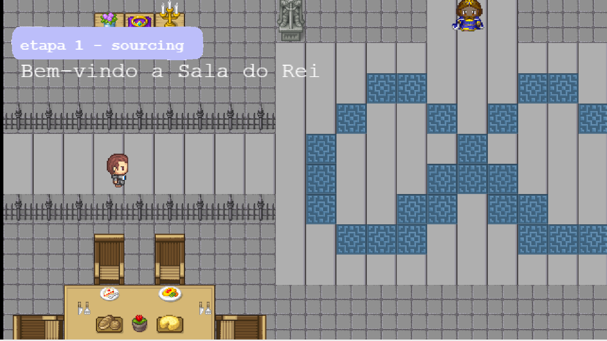

Fonte: Material produzido pelos autores, 2024

&nbsp;&nbsp;&nbsp;&nbsp;Na sprint 3 já tínhamos os dois primeiros minigames. Entretanto, a lógica de conexão entre esses minijogos e os diálogos de ajuda não havia sido implementada.

&nbsp;&nbsp;&nbsp;&nbsp;Agora, após chegar no castelo, o Tyler conversa com o rei, que lhe explica o que ele deve fazer no inicio do processo de contratação, e em seguida o encaminha para a sala da escriba, que fará as ultimas instruções antes do jogador embarcar na sua jornada de interação com o game.

 Figura 45 - Diálogo com o rei 

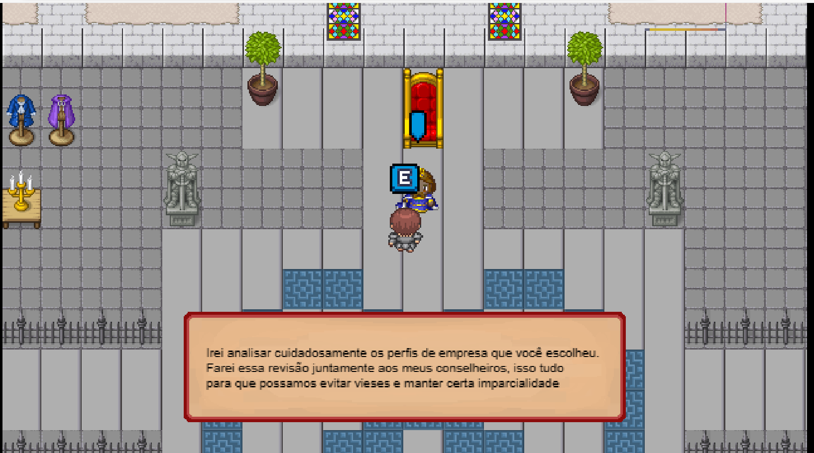

Fonte: Material produzido pelos autores, 2024

 Figura 46 - Dialogo com a escriba 

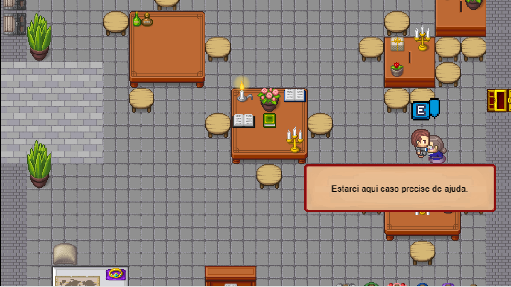

Fonte: Material produzido pelos autores, 2024

&nbsp;&nbsp;&nbsp;&nbsp;O minigame 1 sofreu uma pequena alteração. Com o foco em melhorar a experiência do usuário, foi reduzido o número de perguntas, havendo 9 delas anteriormente, agora tendo apenas 6. Além disso, foi implementado a lógica para quando o personagem não escolham as perguntas mais corretas.

 Figura 47 - As perguntas do minigame 1 

Fonte: Material produzido pelos autores, 2024

 Figura 48 - Possibilidade de melhor escolha 

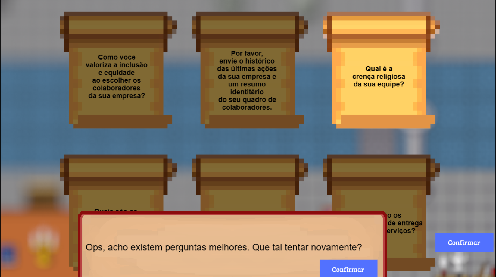

Fonte: Material produzido pelos autores, 2024

&nbsp;&nbsp;&nbsp;&nbsp;Com o fim do minigame 1, o Tyler conversa com a escriba, depois vai até o rei, que após algumas instruções, lhe manda para a escriba de novo, dessa vez para o inicio do minigame 2.

&nbsp;&nbsp;&nbsp;&nbsp;O minigame2 sofreu uma pequena alteração no design, incluindo informações mais realistas dos fornecedores, e também, um novo gráfico.

 Figura 49 - Alteração no design do minigame 2

Fonte: Material produzido pelos autores, 2024

&nbsp;&nbsp;&nbsp;&nbsp;Além de tudo já supracitado, nosso jogo conta com uma nova mecânica de passagem de tempo, onde a tela escurece e esclarece para indicar que se passaram alguns dias.

&nbsp;&nbsp;&nbsp;&nbsp;Foi adicionado o minigame3, nele o Tyler terá que negociar com os 4 fornecedores quase contratados. Utilizando muito da lógica do If e Else, implementamos uma árvore de possibilidades de diálogos possíveis a depender das ações do usuário.

 Figura 38 - Minigame 3 

Fonte: Material produzido pelos autores, 2024

&nbsp;&nbsp;&nbsp;&nbsp;Após toda a negociação, haverá um pouco mais de diálogo com o rei, e então o mais esperado evento começa, a Meta Connect. Foi adicionada uma cena que representará o evento no qual os fornecedores se esforçaram para entregar, a festa do Meta Connect.

 Figura 50 - Meta Connect 

Fonte: Material produzido pelos autores, 2024

&nbsp;&nbsp;&nbsp;&nbsp;Por fim, o Tyler volta de toda essa jornada no metaverso e fala mais uma vez com a Vanessa, dessa vez ela o explica o que aconteceu e o que deveria acontecer se ele continuasse nessa aventura. Isso encerra a jornada de Tyler.

 Figura 51 - A volta do Tyler 

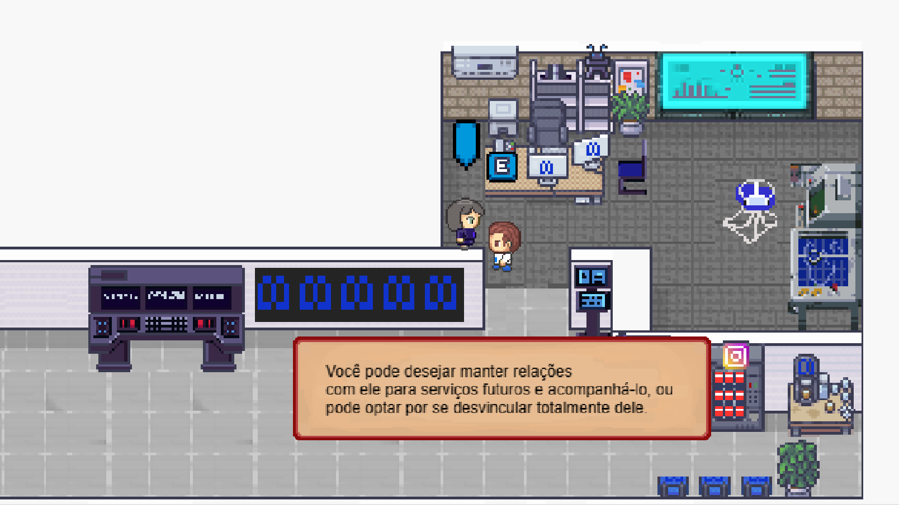

Fonte: Material produzido pelos autores, 2024

**Dificuldades**

&nbsp;&nbsp;&nbsp;&nbsp; A lógica do minigame 3, por se tratar de uma quantidade grande de possibilidades, foi dificil de ser implementada. Ela foi feita através das posições dos diálogos, essas posições eram ligadas a personagem específicos e, a depender da posição, o diálogo aparece em uma posição específica, o valor das posições variam a depender das opções escolhidas pelo jogador. Por esses motivos, o código é pouco escalável, sendo difícil de reproduzí-lo sem alterar os valores e funções dentro do código.

&nbsp;&nbsp;&nbsp;&nbsp;O nosso jogo tinha um grande problema quando você pressionava a tecla de interação com NPC's antes do diálogo acabar de aparecer na tela. Após muitas tentativas, foi possivel consertar esse bug.

**Próximos passos**

&nbsp;&nbsp;&nbsp;&nbsp;Toda a estrutura do jogo já está terminada, nossa meta é melhorar alguns designs, corrigir alguns pequenos bugs que não atrapalham o jogo, mas podem ser arrumados, assim, entregaremos para a Meta o melhor jogo que poderíamos ter criado.

## 4.5. Revisão do MVP

# 5. Testes

## 5.1. Casos de Teste

\# | pré-condição | descrição do teste | pós-condição 
--- | --- | --- | --- 
1| inicio na tela inicial | clicar no botão jogar | abrir cena 1
2| abrir cena | apertar as teclas "W", "S", "A", "D" | personagem se locomover
3| ter funções | importar as funções nas cenas principais | funções executadas na cena principal de forma correta
4| obstáculos no caminho | esbarrar no obstáculo | ser impedido de atravessar
5| personagem chegar na porta do prédio da Meta | tentar entrar na porta | troca para a cena no interior da Meta
6| chegar próximo da Vanessa | apertar "E" | Vanessa se comunica através de textos
7| personagem se aproxima do Meta Quest | pressionar a tecla "E"|mudança para a cena da floresta
8| personagem vai para o lado extremo do mapa | personagem tenta atravessar o mapa | mudança de cena para o caminho ao castelo
9| personagem chega ao extremo do mapa da frente do castelo |personagem tenta atravessar o mapa | mudança para o interior do castelo
10| personagem segue ate o final do corredor do castelo | personagem tenta atravessar o mapa | mudança para a cena da sala do trono
11| personagem se aproxima do rei | pressionar "E" | Começa um diálogo entre o jogador e o rei
12| personagem terminou de falar com o rei e tenta se aproxima do extremo direito do mapa | personagem tenta atravessar o mapa | mudança para a cena da sala do escriba
13| personagem se aproxima da mesa da sala do escriba | pressionar "E" | incia-se o minigame de formação do RFP

## 5.2. Testes de jogabilidade (playtests) (sprint 4)

### 5.2.1 Registros de testes

**Rodada 1**
Nome | Usuário 001
--- | ---
Já possuía experiência prévia com games? | Possuía pouca experiência
Conseguiu iniciar o jogo? | Sim
Entendeu as regras e mecânicas do jogo? | Entendeu, contudo testou primeiro a movimentação com as setas para a movimentação antes de tentar "WASD"
Conseguiu progredir no jogo? | Sim, sem dificuldades  
Apresentou dificuldades? | Não, conseguiu jogar com facilidade
Que nota deu ao jogo? | 9.0
O que gostou no jogo? | Gostou da estética do mapa e dos personagens
O que poderia melhorar no jogo? | Melhorar instrução dos controles (explicitar o uso de "WASD" para movimentação) e remover um bug de colisão na cena inicial

Nome | Usuário 002
--- | ---
Já possuía experiência prévia com games? | Possuía bastante experiência
Conseguiu iniciar o jogo? | Sim
Entendeu as regras e mecânicas do jogo? | Sim, mas primeiro tentou usar as setas para a movimentação
Conseguiu progredir no jogo? | Sim, sem dificuldades  
Apresentou dificuldades? | Não, conseguiu jogar com facilidade
Que nota deu ao jogo? | 8.0
O que gostou no jogo? | Gostou do design do mapa
O que poderia melhorar no jogo? | Melhorar instrução dos controles (explicitar o uso de "WASD" para movimentação) e remover um bug de colisão na cena inicial

Nome | Usuário 002
--- | ---
Já possuía experiência prévia com games? | Possuía bastante experiência
Conseguiu iniciar o jogo? | Sim
Entendeu as regras e mecânicas do jogo? | Sim, mas primeiro tentou usar as setas para a movimentação
Conseguiu progredir no jogo? | Sim, sem dificuldades  
Apresentou dificuldades? | Não, conseguiu jogar com facilidade
Que nota deu ao jogo? | 8.0
O que gostou no jogo? | Gostou do design do mapa
O que poderia melhorar no jogo? | Melhorar instrução dos controles (explicitar o uso de "WASD" para movimentação) e remover um bug de colisão na cena inicial

Nome | Usuário 003
--- | ---
Já possuía experiência prévia com games? | Possuía pouca experiência
Conseguiu iniciar o jogo? | Sim
Entendeu as regras e mecânicas do jogo? | Sim, mas relatou sentir falta de um tutorial
Conseguiu progredir no jogo? | Sim, sem dificuldades  
Apresentou dificuldades? | Não
Que nota deu ao jogo? | 8.0
O que gostou no jogo? | Gostou da proposta do jogo
O que poderia melhorar no jogo? | Melhorar instrução dos controles (explicitar o uso de "WASD" para movimentação) e remover um bug de colisão na cena inicial

Nome | Usuário 004
--- | ---
Já possuía experiência prévia com games? | Não possuía
Conseguiu iniciar o jogo? | Sim
Entendeu as regras e mecânicas do jogo? | Apresentou dificuldades em entender os controles do jogo
Conseguiu progredir no jogo? | Sim, mas com dificuldades  
Apresentou dificuldades? | Sim, com as mecânicas de movimentação
Que nota deu ao jogo? | 9.0
O que gostou no jogo? | Gostou do design do jogo
O que poderia melhorar no jogo? | Instrução dos controles (explicitar o uso de "WASD" para movimentação) e a sinalização do mapa

Nome | Usuário 005
--- | ---
Já possuía experiência prévia com games? | Possuía
Conseguiu iniciar o jogo? | Sim
Entendeu as regras e mecânicas do jogo? | Sim, mas primeiro tentou usar as setas para a movimentação
Conseguiu progredir no jogo? | Ficou preso em uma árvore antes de entrar no prédio da Meta
Apresentou dificuldades? | Não
Que nota deu ao jogo? | 9.5/10
O que gostou no jogo? | Gostou da proposta do mapa ser aberto para a exploração, do design e do _joystick_ para dispositivos móveis
O que poderia melhorar no jogo? | Melhorar colisões e sinalização do caminho que se deve seguir

Nome | Usuário 006
--- | ---
Já possuía experiência prévia com games? | Possuía
Conseguiu iniciar o jogo? | Sim
Entendeu as regras e mecânicas do jogo? | Sim, mas primeiro tentou usar as setas para a movimentação e ficou confuso com o _joystick_
Conseguiu progredir no jogo? | Sim  
Apresentou dificuldades? | Não
Que nota deu ao jogo? | 9.5
O que gostou no jogo? | Gostou do design do mapa e da interação com os _NPCs_
O que poderia melhorar no jogo? | Melhorar as colisões com o jogador

Nome | Usuário 007
--- | ---
Já possuía experiência prévia com games? | Possuía
Conseguiu iniciar o jogo? | Sim
Entendeu as regras e mecânicas do jogo? | Sim, mas somente viu o minimapa no final do teste
Conseguiu progredir no jogo? | Sim 
Apresentou dificuldades? | Não, mas ficou confuso com as pontes
Que nota deu ao jogo? | 9.5
O que gostou no jogo? | Gostou da estética do jogo e do _joystick_ para mobile
O que poderia melhorar no jogo? | Melhorar a instrução dos controles (explicitar o uso de "WASD" para movimentação) e tornar o minimapa mais destacado na tela

Nome | Usuário 008
--- | ---
Já possuía experiência prévia com games? | Possuía
Conseguiu iniciar o jogo? | Sim
Entendeu as regras e mecânicas do jogo? | Sim, mas primeiro tentou usar as setas para a movimentação
Conseguiu progredir no jogo? | Si 
Apresentou dificuldades? | Não, conseguiu jogar com facilidade
Que nota deu ao jogo? | 9.0
O que gostou no jogo? | Gostou da estética do jogo
O que poderia melhorar no jogo? | Melhorar a instrução dos controles (explicitar o uso de "WASD" para movimentação) e tornar o uso do _joystick_ mais intuitivo

### 5.2.2 Melhorias

**Rodada 1**   
Após a realização dos testes, foram implementadas sinalizações para auxiliar os usuários na apreensão das mecânicas de movimentação. Planeja-se, também, adicionar mais indicações quanto a direção que o jogador deve seguir. 

# 6. Conclusões e trabalhos futuros

# 7. Referências

1 Disponível em: https://www.linkedin.com/pulse/apples-vision-pro-offer-7-times-value-metas-quest-3-angus-stevens/. Acesso em: 29 fev. 2024.

2.O que é Concept Art? ⋆ Revo Space. Disponível em: <https://revospace.com.br/artigo/o-que-e-concept-art/>.

3. HEAZLER, E.; RACHMAN, V. S. Concept Art Design For A Game Titled Satrio Piningit. International Journal of Art, Design, and Metaverse, v. 2, n. 1, p. 9–14, 29 fev. 2024.

‌

‌

LUCK, Heloisa. Liderança em gestão escolar. 4. ed. Petrópolis: Vozes, 2010.  
SOBRENOME, Nome. Título do livro: subtítulo do livro. Edição. Cidade de publicação: Nome da editora, Ano de publicação.  

INTELI. Adalove. Disponível em: https://adalove.inteli.edu.br/feed. Acesso em: 1 out. 2023  
SOBRENOME, Nome. Título do site. Disponível em: link do site. Acesso em: Dia Mês Ano

# Anexos
