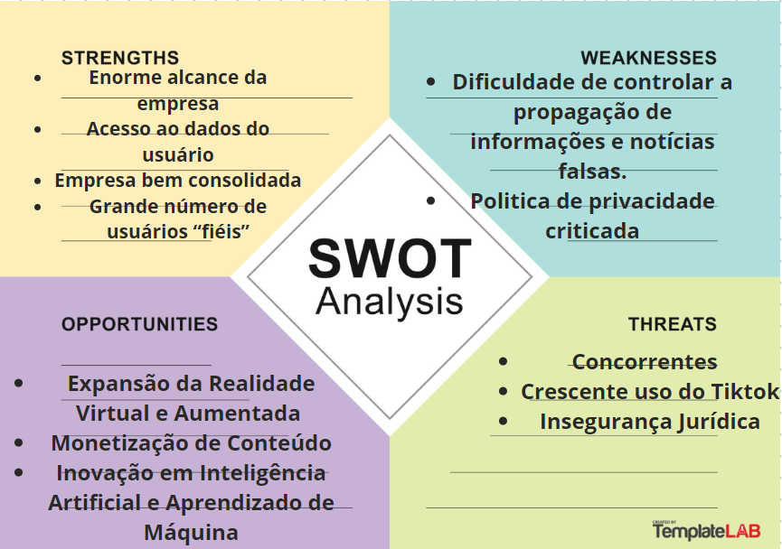
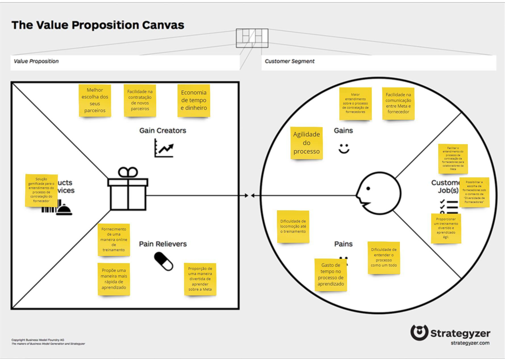
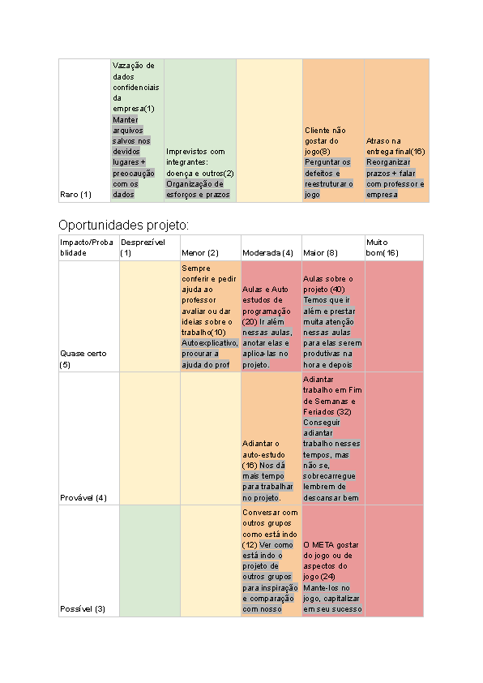
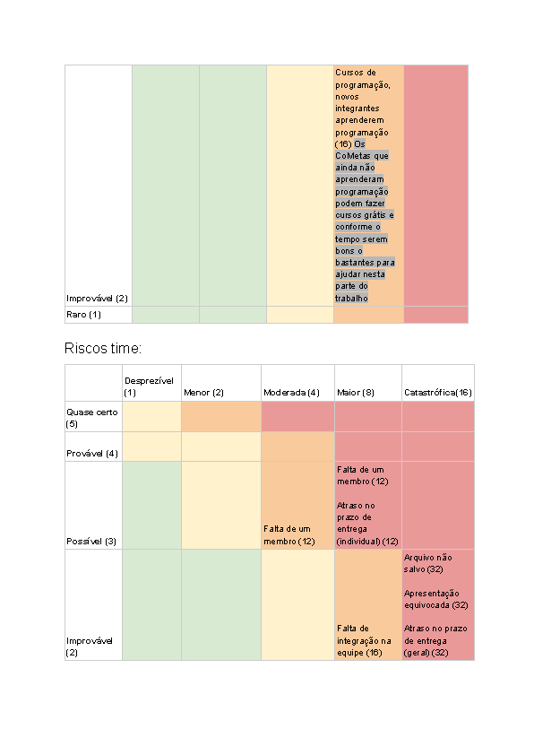
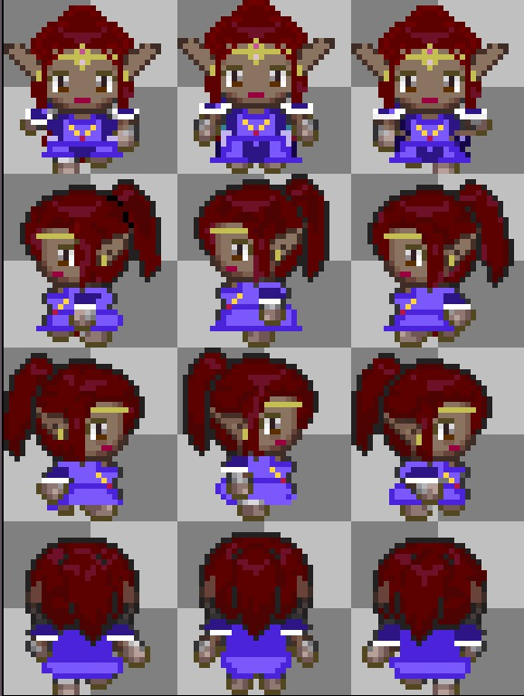
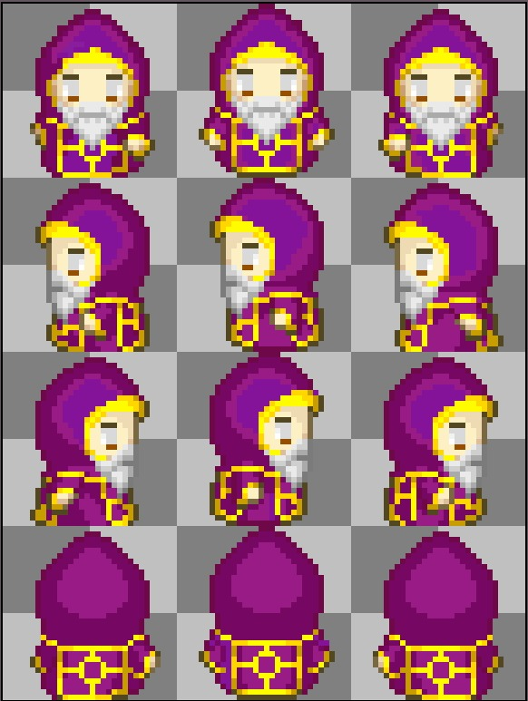

# GDD - Game Design Document - Módulo 1 - Inteli

**_Os trechos em itálico servem apenas como guia para o preenchimento da seção. Por esse motivo, não devem fazer parte da documentação final_**

## Nome do Grupo

#### Nomes dos integrantes do grupo

## Sumário

[1. Introdução](#c1)

[2. Visão Geral do Jogo](#c2)

[3. Game Design](#c3)

[4. Desenvolvimento do jogo](#c4)

[5. Casos de Teste](#c5)

[6. Conclusões e trabalhos futuros](#c6)

[7. Referências](#c7)

[Anexos](#c8)

 

# 1. Introdução (sprints 1 e 4)

## 1.1. Escopo do Projeto

### 1.1.1. Contexto da indústria (sprints 1 e 4)

&nbsp;&nbsp;&nbsp;&nbsp;CONCORRÊNCIA META

- Roblox: uma empresa que simula mundos virtuais permitindo que seus jogadores criem seu próprio mundo. Com uma ideia semelhante, a Meta possuiu o metaverso, espaço no ambiente virtual, onde é possível estudar, trabalhar e ter uma vida social através de seus avatares.
No segundo trimestre de 2021, o número de usuários no Roblox foi de 43,2 milhões, apresentando um crescimento de 29% em relação ao último ano - mostrando assim a potência do RBLX com seus concorrentes. 

- TikTok: o aplicativo de vídeos curtos apresentou um aumento de 43% no número de usuários em 2023. A maioria dos usuários prefere o TikTok em comparação ao reels (uma cópia dos vídeos de curta metragem do tiktok), apesar de haverem mais usuários de produtos Meta em um contexto global.
    - Segundo a Forbes Brasil, a escolha de criadores de conteúdo está no tiktok, com 56,7% da preferência. Em segundo lugar está o Instagram com 36,6%. Por mais que o Instagram ainda seja mais usado que o tiktok, essa plataforma se tornou um concorrente notável já que seu crescimento é muito rápido com avanço de 210% de 2021 para 2022 tornando-se a marca com o crescimento mais rápido.

- Apple: Em relação a redes sociais, Apple e Meta competem entre melhor comunicação online e compartilhamento de conteúdo, com iMessage e Whatsapp. Países como China, Síria, Irã e Etiópia não usam o whatsapp por estarem banidos de seus países. Além disso, Apple e Meta competem entre suas tecnologias de realidade aumentada e realidade virtual, a Apple com o Vison Pro e a Meta com o Meta Quest 3. 

- X (Twitter): A Meta lançou uma nova rede social (Threads) que deve competir com o X (antigo Twitter). Esse novo aplicativo é baseado em conversas no formato de texto que reúnem pessoas para discutir sobre vários temas. Segundo a Folha de São Paulo, Mark Zuckerberg pretende ser o maior rival do Twitter, influenciando usuários do Twitter a usar sua nova rede social.

- Snapchat: Em 2016, com o lançamento dos Stories no Instagram, o Snapchat passou a ser um concorrente da Meta, visto que o Snapchat possuía uma ferramenta muito semelhante, a “Minha História”, na qual os usuários podiam publicar vídeos ou fotos com duração de 24 horas.

- Amazon: Amazon e Meta têm uma disputa indireta pelo envolvimento do consumidor com suas tecnologias, visto que a Amazon possui seu assistente virtual, a Alexa, e a Meta o Meta Quest. Ambas as empresas também possuem seu serviço de nuvem, Amazon com seus Webservices (AWS), que a torna uma das principais provedoras de serviços em nuvem, enquanto a Meta fornece serviços de nuvem (WhatsApp CloudAP) em menor escala.

- Google: Grande concorrente em termos de publicidade, além de possuir a plataforma social Youtube, que compete com as redes sociais da Meta. O YouTube possui 138 milhões de usuários enquanto o Instagram tem cerca de 122 milhões.

<b>Tendências</b> 

- Vídeos curtos como o Reels no Instagram.

- Advocacia ativa (posicionamento em relação à política e aos direitos humanos). Essa tendência traz aumento da participação e engajamento do público em causas sociais, através de canais para manifestar sua opinião, apoiar protestos, entre outros. Para empresas, é importante que participem para que tenham uma comunicação de marketing alinhada com o público.

- A Meta desenvolve práticas em realidade aumentada e virtual, com produtos como os óculos Meta Quest. 

- O Metaverso tornou-se a criação mais desejada pela Meta. Com seu ambiente virtual, é possível criar avatares, conversar com pessoas e jogar, isso pode ser especialmente útil para usuários que estão fisicamente longe, além de revolucionar a forma com que as pessoas se comunicam e interagem.

- Comércio/compras online tem crescido muito no universo de serviços da Meta, a ideia é cada vez mais expandir o poder de compra dos usuários diretamente através das plataformas de rede social, como por exemplo as lojas de roupa no Instagram, que podem alcançar mais clientes e interagir com eles pela própria plataforma (usando, por exemplo, o “Direct” do Instagram).

<b>Poder do fornecedor</b> 

&nbsp;&nbsp;&nbsp;&nbsp;A Meta busca empresas diversificadas, procurando parceiras que são inclusivas e socialmente responsáveis, evitando manter relações com empresas com algum tipo de problema no passado, como trabalho análogo a escravidão. A Meta procura características importantes para a sociedade dentro de empresas parceiras. Como exemplo disso tem-se a busca por empresas que tenha, pelo menos, 51% do seu quadro de colaboradores formado por pessoas que componham grupos excluídos da sociedade, tais como mulheres, pessoas negras e pessoas da comunidade LGBTQIA+.

<b>Poder do consumidor</b> 

&nbsp;&nbsp;&nbsp;&nbsp;A Meta desenvolve tecnologias que ajudam as pessoas a se conectar, encontrar comunidades e expandir negócios. Entretanto, algumas empresas também oferecem serviços parecidos, o que aumenta o poder de barganha dos clientes. Entretanto, pouquíssimas empresas fazem com a mesma qualidade, voltando o poder de barganha para a Meta. As redes sociais da Meta são totalmente gratuitas, o que aumentan o engajamento do seu negócio e uso de suas plataformas. Além disso, produtos como o Meta Quest trazem experiências únicas ao usuário, colocando-os dentro de um universo novo e muitas vezes inimaginável, contudo, por esse serviço não ser gratuito, acaba por ocupar uma menor porcentagem dos clientes totais.

<b>Modelo de negócios</b> 

Segmentação de mercado:

- A Meta desenvolve aplicações de mídias sociais através de dois segmentos, Família de Aplicações (FoA) e Laboratórios de Realidade (RL). Fazem parte do FoA o Instagram, Whatsapp, Facebook, entre outros, já a RL consiste em hardware e software voltados a realidade aumentada e virtual.

Proposta de valor:

- Produtos e Serviços: A Meta trabalha com diversos serviços, segundo a própria empresa os seus produtos variam entre redes sociais(Instagram, Whatsapp, Facebook), dispositivos da marca Meta Portal, Meta Spark, Lojas, Apps NPE Team, Audience Network da Meta, ferramentas de negócios etc.

- Criadores de ganho: O cliente da Meta se mantém sempre atualizado em relação ao mundo devido a sua alta gama de conexão dentro das suas redes sociais e também ganha experiências únicas através da realidade aumentada.

- Aliviam as dores: A comunicação é a chave no mundo moderno, e é expandindo-a que a Meta ajuda a aliviar as dores da sociedade, já que a falta de comunicação social é algo que a empresa contribui para resolver.

Fontes de receita:

- O principal método de ganho da Meta são os espaços de propaganda vendidos em suas redes sociais, além de seus produtos de realidade aumentada.

Modelo de negócios, visão de mercado

- Segmentação de mercado:

    - A Meta desenvolve aplicações de mídias sociais através de dois segmentos, Família de Aplicações (FoA) e Laboratórios de Realidade (RL). Fazem parte do FoA o Instagram, Whatsapp, Facebook, entre outros, já a RL consiste em hardware, software realidade aumentada e virtual.

- Proposta de valor:

    - Produtos e Serviços: A Meta trabalha com diversos serviços, segundo a própria empresa os seus produtos variam entre redes sociais(Instagram, Whatsapp, Facebook), dispositivos da marca Meta Portal, Meta Spark, Lojas, Apps NPE Team, Audience Network da Meta, ferramentas de negócios.

    - Criadores de ganho: O cliente da Meta se mantém sempre atualizado em relação ao mundo devido a sua alta gama de conexão dentro das suas redes sociais e também ganha experiências incríveis através da realidade aumentada

    - Aliviam as dores: A comunicação é a chave no mundo moderno, e é expandindo-a que a Meta ajuda a aliviar as dores da sociedade, já que a falta de comunicação social é algo que a empresa ajuda a resolver

Fontes de receita:

- O principal método de ganho da Meta são os espaços de propaganda vendidos em suas redes sociais, além de seus produtos de realidade aumentada.

Visão de diversidade: 

- A Meta busca empresas diversificadas, procurando parceiras que são inclusivas e socialmente responsáveis, um exemplo disso é que é importante que sua colaboradora tenha pelo menos 51% da empresa formada por pessoas que compõem grupos excluídos da sociedade(mulheres, negros, LGBTQIA+). Além disso, a Meta evita parcerias com empresas com algum tipo de envolvimento com questões como trabalho análogo a escravidão ou outras questões em que há a infração de direitos fundamentais e regulações internacionais.

### 1.1.2. Análise SWOT (sprints 1 e 4)

&nbsp;&nbsp;&nbsp;&nbsp;A análise SWOT é uma ferramenta de gestão que se baseia no estudo das forças, fraquezas, oportunidades e ameaças a uma situação ou empresa, produto, indústria ou até uma pessoa. Inclusive, o acrônimo SWOT é uma sigla para Forças (Strengths), Fraquezas (Weaknesses), Oportunidades (Opportunities) e Ameaças (Threats).

 Nossa análise SWOT do parceiro:
 
 

    
 Figura 1 - Matriz SWOT

Fonte: Material produzido pelos autores, 2024

<b>Strengths (Forças):</b>

- Sendo uma das maiores plataformas de mídias sociais, a empresa possui mais de 2,8 bilhões de usuários ativos, dando-lhe um alcance enorme.

- A Meta tem grande acesso de dados dos seus usuários, os quais podem ser aproveitados para melhorar seus produtos e serviços.

- É uma empresa consolidada no mercado, tendo a reputação de atrair os melhores talentos e investir no desenvolvimento de funcionários.

- Os algoritmos da Meta estão entre os mais avançados no setor da tecnologia, o que permite o direcionamento de anúncios e proporciona experiências de usuário altamente personalizadas.

- A meta possui diversos fluxos de receita, incluindo publicidade e realidade virtual. Essa diversificação protege a empresa de qualquer fonte de receita única.

<b>Weaknesses (Fraqueza):</b>

- A Meta enfrentou muitas críticas da mídia e do governo americano em relação a sua política de privacidade.

- Dificuldade de controlar e limitar a propagação de informações erradas e notícias falsas.

- Como a empresa depende do envolvimento dos usuários, ela usa táticas para manter esses usuários conectados na plataforma por longos períodos, o que gera preocupação com a saúde mental do público.

- Envolvimento da empresa em escândalos, o que pode afetar sua reputação e a visão do público quanto a sua confiabilidade.

<b>Opportunities (Oportunidades):</b>

- Expansão da Realidade Virtual e Aumentada (VR/AR): A Meta tem enormes investimentos em tecnologias de VR/AR com o Oculus Rift e o Oculus Quest. O cenário global atual oferece oportunidades para expandir essas tecnologias além do entretenimento, incluindo aplicativos para educação, treinamento corporativo, colaboração remota e saúde.

    
 Figura 2 - óculos Virtual 

Fonte: Página do Angus Stevens no LinkedIn[1](https://github.com/Inteli-College/2024-T0014-IN01-G03/blob/main/document/gdd.md#7-refer%C3%AAncias-sprint-5), 2023

- Integração de Comércio Eletrônico: Com o crescimento contínuo do comércio eletrônico globalmente, a Meta pode explorar oportunidades para integrar mais recursos de compra e venda diretamente em suas plataformas, oferecendo aos usuários uma experiência de compra mais fluida o que acaba, consequentemente, aumentando sua receita por meio de comissões e publicidade.

- Monetização de Conteúdo: A empresa pode continuar explorando diferentes maneiras de monetizar o conteúdo gerado por usuários em suas plataformas, incluindo modelos de assinatura, publicidade direcionada e transações de conteúdo premium.

- Inovação em Inteligência Artificial e Aprendizado de Máquina: A Meta pode continuar investindo em pesquisa e desenvolvimento em IA e aprendizado de máquina para melhorar a relevância do conteúdo, personalizar experiências do usuário e fornecer ferramentas mais poderosas para os criadores de conteúdo.

- Privacidade e Segurança de Dados: Com as preocupações crescentes com privacidade e segurança de dados, a Meta pode aproveitar a oportunidade para liderar o desenvolvimento de novas tecnologias e práticas que protejam melhor os dados dos usuários e promovam a confiança em suas plataformas.

<b>Threats (Ameaças):</b>

- Concorrência:  Com a crescente do TikTok, o instagram perde a exclusividade e se torna um ponto de ameaça.
    - Manobra feita foi: Criação do reels.

- Recentemente a Meta se envolveu em diversos escândalos (assédio, trafico de pessoas etc.), os quais podem afetar a confiança dos usuários nos serviços da empresa.

### 1.1.3. Descrição da Solução Desenvolvida (sprints 1 e 4)

&nbsp;&nbsp;&nbsp;&nbsp;Nosso parceiro enfrenta um desafio devido à falta de uma ferramenta abrangente que cubra todas as etapas do processo de contratação de fornecedores, da seleção ao pagamento. Para superar essa questão, propomos uma abordagem gamificada, implementando um jogo envolvente que apoiará colaboradores e áreas no entendimento do processo de contratação de fornecedores na Meta.

&nbsp;&nbsp;&nbsp;&nbsp;Essa solução gamificada promoverá maior engajamento e interação, utilizando elementos lúdicos e desafios para tornar a experiência mais motivadora. Além de ser didático, o jogo servirá como facilitador para a apreensão de um processo complexo, assegurando que todos os envolvidos tenham uma compreensão clara e possam tomar decisões informadas de maneira eficiente.

### 1.1.4. Proposta de Valor (sprints 1 e 4)

&nbsp;&nbsp;&nbsp;&nbsp;Value proposition canvas, ou canvas de proposta de valor, é uma ferramenta de análise de público consumidor, que ajuda a entender dores, necessidades e desejos. Essa metodologia baseia a tomada de decisões nos mais diversos níveis e também dá suporte a lançamentos.

&nbsp;&nbsp;&nbsp;&nbsp;A empresa necessita de um jogo que ajude seus colaboradores a entender o processo de contratação de fornecedores, para isso, montamos um canvas de valor com os benefícios do projeto para a Meta e para seus funcionários, além de pensar nos problemas que estão sendo resolvidos e o impacto dessa solução no contexto da empresa.
&nbsp;&nbsp;&nbsp;&nbsp;Um canva de valor avalia o problema a ser resolvido, como fazer isso, as dores do cliente, como aliviar essas dores, e também avaliar o que a empresa e os clientes tem a ganhar com isso.

 

    
 Figura 3 - Canvas de Valor

Fonte: Material produzido pelos autores, 2024

### 1.1.5. Matriz de Riscos (sprints 1 e 4)

&nbsp;&nbsp;&nbsp;&nbsp;A matriz de risco é uma ferramenta utilizada em projetos cuja intenção é avaliar a probabilidade de um evento acontecer e quais seriam os impactos (consequências), ou seja, de que forma ele afetaria o ambiente de trabalho. É importante levar em conta a Matriz de Risco no desenvolvimento de um jogo para se planejar para entrega, se preparando para eventuais problemas, como a correção de bugs ou melhorias solicitadas pelo usuário. Assim, esses problemas se tornam parte do planejamento, evitando atrasos na entrega ou na qualidade do produto.

    
 Figura 4 - Matriz de Risco 1

Fonte: Material produzido pelos autores, 2024

    
 Figura 5 - Matriz de Risco 2

Fonte: Material produzido pelos autores, 2024

    
 Figura 6 - Matriz de Risco 3 

Fonte: Material produzido pelos autores, 2024

## 1.2. Requisitos do Projeto (sprints 1 e 2)

\# | Requisito  
--- | ---
1 | O controle do personagem será realizado usando as teclas WASD para navegação pelas fases
2 | O jogo possuirá um mini tutorial instruindo o jogador
3 | O jogo deve possuir uma tela de abertura para o jogador selecionar se quer jogar, ver opções ou os créditos
4 | No jogo vai ter um npc que sempre irá atualizar o jogador com informações do objetivo

## 1.3. Público-alvo do Projeto (sprint 2)

&nbsp;&nbsp;&nbsp;&nbsp;O jogo é destinado para todos colaboradores da Meta interessados em desenvolver suas habilidades e realizar contratações de fornecedores pautados no princípio da diversidade de fornecedores.

# 2. Visão Geral do Jogo (sprint 2)

## 2.1. Objetivos do Jogo (sprint 2)

&nbsp;&nbsp;&nbsp;&nbsp;O objetivo do jogo é proporcionar uma simulação prática e cativante das etapas envolvidas na contratação de fornecedores para a empresa Meta. O jogador assume o papel de um colaborador em busca de um entendimento profundo do processo de contratação. O jogo é estruturado em fases, cada uma correspondendo a uma etapa desse processo, permitindo que o jogador entenda o funcionamento e detalhes envolvidos em cada uma delas, finalizando o jogo com o conhecimento necessário para realizar a contratação de fornecedores de acordo com os critérios estabelecidos pela Meta.

## 2.2. Características do Jogo (sprint 2)

### 2.2.1. Gênero do Jogo (sprint 2)

&nbsp;&nbsp;&nbsp;&nbsp;Nosso jogo será estilo _RPG Top Down_ no qual o jogador tem o seu personagem, o Tyler, um colaborador recém-contratado da Meta que procura entender melhor o processo de contratação da empresa. Neste jogo, há uma fase para representar cada etapa do processo de contratação. O andamento do jogo se dá por meio da alternancia entre momentos de narração e _minigames_, nos quais o jogador terá que atingir todos os requisitos para conseguir avançar de fase e, por fim, chegar ao fim do jogo. 
&nbsp;&nbsp;&nbsp;&nbsp;Tomamos como inspiração alguns jogos como Pokémon, principalmente [Pokémon FireRed](https://www.nintendo.pt/Jogos/Game-Boy-Advance/Pokemon-FireRed-267123.html) e [Pokémon Ruby](https://www.nintendo.pt/Jogos/Game-Boy-Advance/Pokemon-Ruby-267167.html), e no jogo [The Legend of Zelda: The Minish Cap](https://www.nintendo.pt/Jogos/Game-Boy-Advance/The-Legend-of-Zelda-The-Minish-Cap-267486.html), todos da [Nintendo](https://www.nintendo.pt/).

### 2.2.2. Plataforma do Jogo (sprint 2)

&nbsp;&nbsp;&nbsp;&nbsp;Quanto ao dispositivo: desktops. Buscamos disponibilizá-lo, também, para smartphones.
&nbsp;&nbsp;&nbsp;&nbsp;quanto ao sistema: apenas web.

### 2.2.3. Número de jogadores (sprint 2)

&nbsp;&nbsp;&nbsp;&nbsp;O jogo foi pensado e desenvolvido para apenas um jogador.

### 2.2.4. Títulos semelhantes e inspirações (sprint 2)

&nbsp;&nbsp;&nbsp;&nbsp;Como supracitado no item 2.2.1, tivemos diversas inspirações durante o desenvolvimento. Quanto ao estilo, um rpg top down, tomamos como base jogos da franquia Pokémon, principalmente [Pokémon FireRed](https://www.nintendo.pt/Jogos/Game-Boy-Advance/Pokemon-FireRed-267123.html) e [Pokémon Ruby](https://www.nintendo.pt/Jogos/Game-Boy-Advance/Pokemon-Ruby-267167.html), e no jogo [The Legend of Zelda: The Minish Cap](https://www.nintendo.pt/Jogos/Game-Boy-Advance/The-Legend-of-Zelda-The-Minish-Cap-267486.html), todos da [Nintendo](https://www.nintendo.pt/).
Também temos um design baseado na [Twilight Forest](https://www.curseforge.com/minecraft/mc-mods/the-twilight-forest),um mod de [Minecraft](https://www.minecraft.net/pt-br) que mistura diversos elementos fantásticos, como fadas e castelos, porém apresentando-os com um clima mais misterioso e sombrio.

### 2.2.5. Tempo estimado de jogo (sprint 5)

&nbsp;&nbsp;&nbsp;&nbsp;O jogo pode ser concluído em até 20 minutos. O tempo final do jogo depende do jogador, visto que, só é possível avançar no jogo completando as fases corretamente, tendo de repeti-las em outro caso.  

# 3. Game Design (sprints 2 e 3)

## 3.1. Enredo do Jogo (sprints 2 e 3)
&nbsp;&nbsp;&nbsp;&nbsp;Tyler, o protagonista do jogo, é um novo colaborador da Meta. Como novo colaborador, ele precisa passar pelo treinamento que vai capacitá-lo a contratar fornecedores "aos moldes Meta de contratação". Nesse processo de treinamento, Tyler irá receber a ajuda da Vanessa, uma colaboradora do time de _Diversity Supply_ que testará, juntamente com a Equipe de Inovação, um novo treinamento que se utiliza de tecnologias de realidade virtual para ensinar todo o processo de contratação de fornecedores em um mundo fictício dentro do _metaverso_.  
&nbsp;&nbsp;&nbsp;&nbsp;Assim, Tyler embarca em uma aventura em um universo fantástico com a missão de ajudar um rei a se preparar para enfrentar um grande mal que se aproxima do reino auxiliando-o a fazer alianças com poderosos generais, como a Celeste, a Aysla, o Romeo e o Gizmo. Aqui, o reino e o próprio rei são uma metáfora a Meta, com o reino possuindo os valores da empresa e seguindo um processo de formação de alianças que é uma paráfrase do processo de contratação de fornecedores da Meta, enquanto os generais e seus exércitos personificam os fornecedores.

## 3.2. Personagens (sprints 2 e 3) 

### 3.2.1. Controláveis
 
&nbsp;&nbsp;&nbsp;&nbsp;Em nosso jogo existe apenas um personagem controlado pelo jogador, o Tyler. Ele representa um novo colaborador da Meta e sua missão é compreender plenamente o processo de contratação de fornecedores, buscando sempre fazer escolhas que respeitem o principal princípio da empresa: a diversidade. Visando fortalecer a rede de fornecedores de forma inclusiva, Tyler enfrenta desafios que exigem discernimento e sensibilidade cultural, em que suas escolhas influenciam não apenas o sucesso da empresa, mas também seu compromisso com a promoção e valorização da diversidade de fornecedores e justiça social.

 Figura 7 - Tyler

Fonte: Material produzido pelos autores, 2024

 Figura 8 - Tyler com armadura

Fonte: Material produzido pelos autores, 2024

### 3.2.2. Non-Playable Characters (NPC)

&nbsp;&nbsp;&nbsp;&nbsp;Como mencionado no item 3.2.1, a diversidade de fornecedores é essencial para empresa Meta. Desse modo, buscamos desenvolver NPCs que representem essa diversidade e inclusão, a fim de promover a igualdade de oportunidades. Cada um desses NPCs traz consigo características e experiências únicas, são eles:                                             

Celeste: Uma Elfa com traços afrodescendente que representa a população feminina e negra.                                                    

 Figura 9 - Celeste

Fonte: Material produzido pelos autores, 2024

Aysla: Uma druida portadora de albinismo, representando a diversidade em suas múltiplas formas.

 Figura 10 - Aysla

Fonte: Material produzido pelos autores, 2024

Romeo: Um mago com deficiência visual, cuja presença destaca a importância da inclusão de pessoas com deficiência.

 Figura 11 - Romeo

Fonte: Material produzido pelos autores, 2024

Gizmo: Um arqueiro com deficiência física, cuja habilidade e determinação desafiam qualquer tipo de estereótipo.

 Figura 12 - Gizmo

Fonte: Material produzido pelos autores, 2024

### 3.2.3. Diversidade e Representatividade dos Personagens
&nbsp;&nbsp;&nbsp;&nbsp;Dentro o nosso jogo, temos como representação de fornecedores personagens que promovem a diversidade:

- Através do Gizmo, personagem que utiliza uma prótese na sua perna esquerda, buscamos mostrar que, independente de qualquer condição física, pessoas com deficiência são capazes de desempenhar suas funções com excelência.  

- Romeo será um mago com deficiência visual. Ele é capaz de se orientar através do som do ambiente e da leitura de energias. Nosso objetivo com esse general (fornecedor) é muito semelhante ao objetivo que temos com o Gizmo: mostrar que pessoas com deficiência são plenamente capazes de desempenhar suas funções.

- Com a "Aysla" queremos representar pessoas com a condição de ausência de melanina (Albinismo), colocando-a como uma Druida amante da fauna e da flora. Por meio dessa personagem, também almejamos trazer aspectos da responsabilidade ambiental e cuidado com os recursos naturais.

- Celeste é uma elfa com traços afrodescendentes, representando a população feminina e preta. A personagem também de constitui de um símbolo de poder e pureza através de uma posição celestial e espirituosa, possuindo uma posição de destaque no contexto do jogo. Assim, procura-se desassociar qualquer pensamento preconceituoso e obsoleto referente a pessoas de pele preta e a sua posição dentro da sociedade. 

## 3.3. Mundo do jogo (sprints 2 e 3)

### 3.3.1. Locações Principais e/ou Mapas (sprints 2 e 3)
&nbsp;&nbsp;&nbsp;&nbsp;Este é o mapa inicial, uma avenida onde fica o escritório da Meta. Como primeiro mapa do jogo, espera-se que nesse mapa o jogador aprenda os comandos de movimentação do personagem enquanto seque para o interior do edifício da Meta.

 Figura 13 - Mapa Inicial

Fonte: Material produzido pelos autores, 2024

&nbsp;&nbsp;&nbsp;&nbsp;Por sua vez, tem-se aqui a sala na qual o protagonista deverá usar o _Meta Quest_ e entrar no Metaverso.

 Figura 14 - Escritório

Fonte: Material produzido pelos autores, 2024

&nbsp;&nbsp;&nbsp;&nbsp;Neste momento, tem-se uma parcela do mapa referente ao Metaverso: uma floresta onde o Tyler iniciará sua aventura nesse novo mundo.

 Figura 15 - Floresta

Fonte: Material produzido pelos autores, 2024

    
&nbsp;&nbsp;&nbsp;&nbsp;Além disso, há também um cenário que representa o interior do castelo do rei. Aqui, o Tyler deve se locomover até o salão real (ainda me desenvolvimento), onde o rei o aguarda.

 Figura 16 - Castelo

Fonte: Material produzido pelos autores, 2024

### 3.3.2. Navegação pelo mundo (sprints 2 e 3)

3.3.2. Exploração do Mundo (Sprints 2 e 3)

1. Configurações Iniciais:
   - Na tela inicial, o jogador seleciona o idioma desejado (inglês ou português). Em seguida, encontra a opção "Jogar" para iniciar efetivamente o jogo.

2. Controles do Personagem:
   - Utilizando os seguintes controles:
     - W: Movimento para cima
     - S: Movimento para baixo
     - A: Movimento para a esquerda
     - D: Movimento para a direita

3. Transição para a Segunda Cena:
   - Ao clicar em " Play", o personagem controlável, Tyler, é teleportado para a segunda cena, localizada na rua em frente ao prédio da Meta. O jogador utiliza os controles para guiar Tyler até a empresa Meta, situada no canto direito da tela.

4. Transição Automática para a Terceira Cena:
   - Ao se deslocar até a porta do prédio da Meta, o personagem é automaticamente teleportado para a terceira cena. Nessa cena, Tyler encontra Vanessa, que fornece as devidas instruções e o encaminha para os óculos de realidade virtual, os quais o levarão para o metaverso (onde ocorre a quarta cena).

5. Avanço para a Quarta Cena - Floresta (Metaverso):
   - Ao concluir a terceira cena, o jogador é teleportado para uma floresta, onde Tyler encontra um NPC que oferece orientações importantes durante a jornada e o direciona para a próxima cena.

6.  Quinta cena: Transição entre Floresta e Castelo:
   - Ao atravessar uma ponte no final da floresta, Tyler entra na quinta cena, um jardim em frente ao castelo. Um novo NPC orientador direciona Tyler ao castelo do rei.

7. Sexta cena: Castelo
   - Ao adentrar o castelo, Tyler é inserido na sexta cena, situada no corredor que o induz até a sala do rei.

8.  Sétima cena:  Sala do Rei
   - Na sétima cena, localizada na sala do rei, Tyler recebe instruções muito importantes do monarca e participa dos minigames 1 e 2.

9. Próximos Passos em Desenvolvimento:

   - Detalhes sobre os próximos passos e cenas do jogo estão atualmente em processo de estruturação.

3.3.3) Em nosso jogo, não há presença de condições climáticas ou temporais. Optamos por criar um ambiente imersivo, no qual não ocorram variações de tempo, a fim de que o jogador mantenha o foco nas mecânicas e desafios específicos de cada fase. Além disso, não impomos restrições temporais, visando possibilitar que o jogador explore o ambiente e resolva os desafios em seu próprio ritmo. Considerando que o jogo tem como objetivo o aprendizado, essa abordagem busca proporcionar aos jogadores um envolvimento mais profundo com a narrativa do jogo, permitindo que compreendam o processo de contratação de fornecedores sem a interferência de limites de tempo e condições climáticas.

### 3.3.3. Condições climáticas e temporais (sprints 2 e 3)

*Em nosso jogo, não há presença de condições climáticas ou temporais. Optamos por criar um ambiente imersivo, no qual não ocorram variações de tempo, a fim de que o jogador mantenha o foco nas mecânicas e desafios específicos de cada fase. Além disso, não impomos restrições temporais, visando possibilitar que o jogador explore o ambiente e resolva os desafios em seu próprio ritmo. Considerando que o jogo tem como objetivo o aprendizado, essa abordagem busca proporcionar aos jogadores um envolvimento mais profundo com a narrativa do jogo, permitindo que compreendam o processo de contratação de fornecedores sem a interferência de limites de tempo e condições climáticas.

### 3.3.4. Concept Art (sprint 2)

 Figura 17: Personagem Celeste em _spritesheets_

Fonte: Material produzido pelos autores, 2024

 Figura 18 - Personagem Romeo em _spritesheets_

Fonte: Material produzido pelos autores, 2024

 Figura 19 - Concept art do pergaminho e perfis dos exercicitos 

### 3.3.5. Trilha sonora (sprint 3)

A trilha sonora do jogo foi feita através de áudios disponibilizados pela Pixbay, são aúdios liberados para o uso que servem para ambientar o nosso jogo, trazendo uma sensação de imersividade no jogador. Essa imersividade é implementada através de sons do ambiente ali representado, como o som de pássaros na cena na floresta, por exemplo.

*Exemplo de tabela*
\# | titulo | ocorrência | autoria
--- | --- | --- | ---
1 | passosConcreto | Personagem andando no chão de concreto | Pixbay
2 | passos | Personagem andando na terra |Pixbay
3 | predioAudio | Cena em frente ao prédio |Pixbay
4 | passaros | Cena na natureza |Pixbay
5 | oceano | Cena na ponte |Pixbay
6 | musicaRei | Cena no castelo e adiante |Pixbay

## 3.4. Inventário e Bestiário (sprint 3)

### 3.4.1. Inventário

*Em nosso jogo, decidimos manter a simplicidade e foco no aprendizado, excluindo a presença de poderes ou itens para coletar. Priorizamos uma abordagem direta, sem títulos, imagens específicas ou meios de obtenção de itens, já que nosso objetivo principal é proporcionar uma experiência educativa eficiente e sem distrações.

### 3.4.2. Bestiário

* Optamos por não incluir inimigos em nosso jogo, priorizando desafios e minigames que refletem, de maneira autêntica, o complexo processo de contratação. Ao invés de simples inimigos tradicionais, os jogadores enfrentarão uma série de desafios específicos ao longo de sua jornada. Esses minigames proporcionam uma compreensão mais aprofundada do intricado processo de seleção e serão detalhados em uma seção posterior.

## 3.5. Gameflow (Diagrama de cenas) (sprint 2)

[Gameflow (diagrama de cenas)](https://www.figma.com/file/pAGJO8K0EiS1LBVF8aQPS8/Storyboard-de-programa%C3%A7%C3%A3o-(Diagrama-de-cenas)?type=whiteboard&t=596Q4PORtJdAKPrV-1) das duas telas inciais do jogo.

 figura 19 - 

Fonte: Material produzido pelos autores, 2024

## 3.6. Regras do jogo (sprint 3)

  O objetivo principal do jogador é entrar em uma jornada para compreender o processo de contratação da Meta, guiado por etapas estruturadas no jogo. No decorrer das etapas, o rei assume papel de instrutor e passa informações importantes sobre o processo de contratação, além de direcionar Tyler para Minigames, que precisam ser realizados corretamente, para que o jogo continue.

ETAPA 1: minigames:

Minigame 1: Ocorre após as instruções do rei. Nesse minigame, são apresentadas diversas perguntas, sendo algumas pertinentes e outras não, que Tyler fará posteriormente aos fornecedores. Essa tarefa consiste em selecionar as perguntas corretas para avançar à próxima fase. Caso o jogador escolha alguma pergunta errada, o rei oferece uma dica para orientar Tyler, proporcionando ao jogador a oportunidade de reiniciar o minigame e tentá-lo novamente.

Minigame 2: Ocorre logo após o minigame 1. Nesse minigame, Tyler deve analisar os pergaminhos que contém informações sobre os exércitos, tais como características do guerreiros, informações das últimas atividades desse exército e informações dos generais desses exércitos. Com base nos critérios de diversidade para estabelecer parcerias, o objetivo é aceitar e recusar os exércitos corretos para concluir o jogo. Se ele errar, o rei oferece dicas novamente. Por fim, o segundo minigame encerra com as escolhas adequadas.

ETAPA 2: Tyler entrega suas respostas obtidas nos minigames ao rei, permitindo que este avalie e emite sua análise sobre as escolhas do jogador, Essa fase representa um momento em que o jogador principal passa por um segundo processo de contratação, aguardando a avaliação do rei para determinar se suas decisões foram acertadas

Nas seguintes etapas(3,4,5,6,7) o Tyler não passará mais por minigames, porém o papel do rei será explicar em detalhes o que ocorre em cada fase. O jogador acompanha as explicações do rei para compreender o funcionamento de cada parte do processo de contratação da Meta. O desfecho do jogo ocorre quando o colaborador conclui cada minigame e supera todas as fases, demonstrando habilidade e conhecimento ao longo do processo seletivo.

## 3.7. Mecânicas do jogo (sprint 3)

*Descreva aqui as formas de controle e interação que o jogador tem sobre o jogo: quais os comandos disponíveis, quais combinações de comandos, e quais as ações consequentes desses comandos. Utilize listas ou tabelas para organizar esta seção.*

*Ex. Em um jogo de plataforma 2D para desktop, o jogador pode usar as teclas WASD para mecânicas de andar, mirar para cima, agachar, e as teclas JKL para atacar, correr, arremesar etc.*

*Ex. Em um jogo de puzzle para celular, o jogador pode tocar e arrastar sobre uma peça para movê-la sobre o tabuleiro, ou fazer um toque simples para rotacioná-la*

O jogo tem um personagem principal que é movimentado através das teclas "AWSD", ele é livre para percorrer todo o mapa, mas possui barreiras que impossibilitam o acesso à alguns lugares. Além das teclas de movimento, existe a tecla "E", que é responsável pela interação entre o personagem e alguns NPC's.
O jogo possui alguns minigames de escolha, e o jogador deve escolher através de cliques nas opções apresentadas na tela. No minigame1 existem várias perguntas a serem selecionadas, e ao clicar em todas as certas e no botão de confirmar, a fase é concluida. Logo depois vem o minigame2, algo muito parecido com verdadeiro ou falso, que também funciona através do clique do mouse.

# 4. Desenvolvimento do Jogo

## 4.1. Desenvolvimento preliminar do jogo (sprint 1)

&nbsp;&nbsp;&nbsp;&nbsp;Nosso personagem principal, o Tyler Calvin, inicia sua jornada em uma rua. O Tyler segue sua trilha e entra em uma nova cena, onde ele encontra a Vanessa, que vai auxiliá-lo no treinamento de contratação de novos fornecedores.

&nbsp;&nbsp;&nbsp;&nbsp;Para começar nosso projeto criamos a spritesheet de movimento do nosso personagem, também selecionamos duas cenas de fundo e aplicamos as barreiras para o personagem não abandonar o cenário do jogo. Utilizamos-nos dos conhecimentos das aulas de programação para movimentar o personagem e estudamos por outras fontes como criar múltipas cenas e, também, como controlá-lo através do teclado.

 Figura 20 - Cena inicial

Fonte: Material produzido pelos autores, 2024

 Figura 21 - Encontro com a Vanessa

Fonte: Material produzido pelos autores, 2024

&nbsp;&nbsp;&nbsp;&nbsp;O único desafio enfrentado foi a mudança de cenas, contudo essa questão foi resolvida através de conteúdos online e aulas da "Semana 4". Assim, conseguimos implementar essa mecânica dentro do nosso primeiro protótipo.

&nbsp;&nbsp;&nbsp;&nbsp;Existem alguns passos que queremos aplicar no futuro, alguns deles são:
- Desenvolver mais personagens, sempre buscando diversidade.
- Estabelecer os estilos do jogo.
- Focar na usabilidade e portabilidade, fazendo com que o jogo possa ser utilizado pelo maior número de colaboradores possível.
- Manter um desenvolvimento próximo à Meta com o objetivo de alinhar expectativas com um processo constante de produção e feedbacks.
- Desenvolvimento completo da história e das mecânicas que vão tornar nosso jogo único!
- Criar uma trilha sonora para o game.

## 4.2. Desenvolvimento básico do jogo (sprint 2)

&nbsp;&nbsp;&nbsp;&nbsp;O projeto é desenvolvido em JavaScript com o uso do _FrameWork_ Phaser, com ele é possível controlar diversas funções utilizadas ao decorrer do código, como a função que controla o personagem ou a que aciona o botão da tela inicial quando clicado.

&nbsp;&nbsp;&nbsp;&nbsp;O jogo começa em uma tela que possui alguns botões, através do código implementamos funções que aumentam o tamanho deles quando o mouse estiver sobre eles. Além disso, o botão de play já está funcional e é responsável por chamar a classe _MainScene_, que é onde a primeira fase do jogo está armazenada.

    
 Figura 22 - Tela Inicial

Fonte: Material produzido pelos autores, 2024

&nbsp;&nbsp;&nbsp;&nbsp;A classe _MainScene_, assim como as outras cenas do jogo, chama algumas classes secundárias, que são responsáveis por armazenar partes especificas do jogo, como o código responsável pela animação, os controles, entre outros. Esses códigos armazenam funções que serão utilizadas mais de uma vez ao decorrer do jogo, por esse motivo, eles são armazenados separadamente, com o intuito de organizar e facilitar a reutilização de códigos.

 Figura 23 - Controle

Fonte: Material produzido pelos autores, 2024

 Figura 24 - MainScene

Fonte: Material produzido pelos autores, 2024

&nbsp;&nbsp;&nbsp;&nbsp;Voltando para a MainScene, o personagem começa em uma rua em frente ao prédio da META, e deve seguir até a porta de entrada, lá o Tyler terá acesso ao predio através do teclado, já que configuramos que a troca de cena acontece quando o jogador apertar a tecla "E", e essa mecânica se repetirá ao longo do jogo, nas interações com NPC's.

 Figura 25 - Prédio da META

Fonte: Material produzido pelos autores, 2024

&nbsp;&nbsp;&nbsp;&nbsp;A ideia em desenvolvimento é que o personagem encontrará a NPC Vanessa dentro da META e ela o ajudará nessa jornada. Dentro do prédio, através do Tyled, implementamos as barreiras na qual o persona vai esbarrar, impedindo-o de atingir determinados pontos do mapa. Essas barreiras estarão por todo o mapa do jogo, seja numa cadeira, numa árvore, em um carro na rua, em qualquer coisa, simulando um pouco da vida real.

 Figura 26 - Interior do castelo

Fonte: Material produzido pelos autores, 2024

&nbsp;&nbsp;&nbsp;&nbsp;Voltando ao que já foi desenvolvido, temos o mapa em que o personagem atravessa uma floresta e chega em um castelo. Tudo isso acontece com as mesmas mecânicas anteriores, com colisões e interações ao longo da jornada.

 Figura 27 - Colisão com árvores e Vanessa

Fonte: Material produzido pelos autores, 2024

&nbsp;&nbsp;&nbsp;&nbsp;A maior dificuldade foi o conteúdo, muitas vezes queríamos implementar algo que ninguém do grupo sabia exatamente como, e a busca pela resposta foi muitas vezes trabalhosa, mas foi possível executar todas as nossas ideias até então.
&nbsp;&nbsp;&nbsp;&nbsp;Até o final da entrega queremos construir todas as nossas cenas de forma funcional, incluir os mini games que estão planejados no momento e adaptar o jogo para o mobile.

## 4.3. Desenvolvimento intermediário do jogo (sprint 3)

*Descreva e ilustre aqui o desenvolvimento da versão intermediária do jogo, explicando brevemente o que foi entregue em termos de código e jogo. Utilize prints de tela para ilustrar. Indique as eventuais dificuldades e próximos passos.*

Na sprint 2 já existia uma ideia muito concreta das metas que queríamos entregar, por esse motivo, durante a sprint 3 poucas coisas foram modificadas, mas muitas coisas implementadas.
O design do castelo foi mudado na intenção de passar a vibe de um castelo da Meta, por isso, a cor azul ganhou destaque na cena. Também mudamos a cena de integração entre a floresta e o castelo para criar um jogo mais dinâmico para o jogador.
O jogo agora conta com a cena do escritório, onde o jogador irá encontrar a Vanessa e terá toda a instrução necessária. Além disso, o castelo agora conta com duas cenas, o corredor e a sala do rei.
A principal alteração do nosso jogo foi a implementação dos diálogos do rei explicando o processo de contratação, junto com os dois minigames que vão testar se o jogador está entendendo o processo.
O rei explicará o Sourcing e o jogador, através de um minigame de escolhas, deverá escolher as melhores perguntas a ser enviadas aos futuros parceiros, após concluir essa etapa, o jogador lerá a resposta das empresas e escolherá as melhores opções para o contrato.
Os minigames foram feitos usando os conhecimentos adquiridos nessas últimas semanas. A lógica para a passagem de cenas apenas quando o jogador passar envolve dar valor para variável de cada pergunta, dobrando o valor anterior, com isso, determinamos qual a soma das variáveis corretas e através de um if autorizar a passagem de cena apenas quando a soma atingir o número esperado.

O objetivo para as próximas semanas é a implementação do idioma inglês e a continuação do processo de contratação, visando que ainda não o explicamos completamente.

## 4.4. Desenvolvimento final do MVP (sprint 4)

*Descreva e ilustre aqui o desenvolvimento da versão final do jogo, explicando brevemente o que foi entregue em termos de MVP. Utilize prints de tela para ilustrar. Indique as eventuais dificuldades e planos futuros.*

## 4.5. Revisão do MVP (sprint 5)

*Descreva e ilustre aqui o desenvolvimento dos refinamentos e revisões da versão final do jogo, explicando brevemente o que foi entregue em termos de MVP. Utilize prints de tela para ilustrar.*

# 5. Testes (sprint 4)

## 5.1. Casos de Teste

&nbsp;&nbsp;&nbsp;&nbsp;Os casos de teste servem para verificar se todas as intenções do programador estão funcionando dentro do jogo, por exemplo, quero que meu jogo inicie em uma tela inicial e ao apertar "jogar", o jogo comece, para isso, preciso definir a pré condição (existência da tela), o teste (clicar no botão "jogar") e a pós condição (o jogo se inicia). Com isso, podemos mapear os erros do nosso jogo, para que assim a correção seja feita, e também, para que entendamos o erro para nao executá-lo novamente.

\# | pré-condição | descrição do teste | pós-condição 
--- | --- | --- | --- 
1| inicio na tela inicial | clicar no botão jogar | abrir cena 1
2| abrir cena | apertar as teclas "W", "S", "A", "D" | personagem se locomover
3| ter funções | importar as funções nas cenas principais | funções executadas na cena principal de forma correta
4| obstáculos no caminho | esbarrar no obstáculo | ser impedido de atravessar
5| personagem chegar na porta do prédio da Meta | tentar entrar na porta | troca para a cena no interior da Meta
6| chegar próximo da Vanessa | apertar "E" | Vanessa se comunica através de textos
7| personagem se aproxima do Meta Quest | pressionar a tecla "E"
| mudança para a cena da floresta
8| personagem vai para o lado extremo do mapa | personagem tenta atravessar o mapa | mudança de cena para o caminho ao castelo
9| personagem chega ao extremo do mapa da frente do castelo |personagem tenta atravessar o mapa | mudança para o interior do castelo
10| personagem segue ate o final do corredor do castelo | personagem tenta atravessar o mapa | mudança para a cena da sala do trono
11| personagem se aproxima do rei | pressionar "E" | Começa um diálogo entre o jogador e o rei
12| personagem terminou de falar com o rei e tenta se aproxima do extremo direito do mapa | personagem tenta atravessar o mapa | mudança para a cena da sala do escriba
13| personagem se aproxima da mesa da sala do escriba | pressionar "E" | incia-se o minigame de formação do RFP
&nbsp;&nbsp;&nbsp;&nbsp;O item 6 pode ter alguns problemas a depender do tamanho da tela do usuario, já que utilizamos coordenadas do mapa para criar a transição. Dessa forma, é possível que o cliente tenha problemas nesse quesito.

## 5.2. Testes de jogabilidade (playtests) (sprint 4)

### 5.2.1 Registros de testes

*Descreva nesta seção as sessões de teste/entrevista com diferentes jogadores. Registre cada teste conforme o template a seguir.*

Nome | Usuário 001
--- | ---
Já possuía experiência prévia com games? | possuía pouca experiência
Conseguiu iniciar o jogo? | sim
Entendeu as regras e mecânicas do jogo? | entendeu, contudo testou primeiro a movimentação com as setas antes de tentar "WASD"
Conseguiu progredir no jogo? | sim, sem dificuldades  
Apresentou dificuldades? | Não, conseguiu jogar com facilidade
Que nota deu ao jogo? | 9.0
O que gostou no jogo? | Gostou da estética do mapa e dos personagens
O que poderia melhorar no jogo? | Instrução dos controles e remover um bug de colisão

### 5.2.2 Melhorias

*Descreva nesta seção um plano de melhorias sobre o jogo, com base nos resultados dos testes de jogabilidade*

# 6. Conclusões e trabalhos futuros (sprint 5)

*Escreva de que formas a solução do jogo atingiu os objetivos descritos na seção 1 deste documento. Indique pontos fortes e pontos a melhorar de maneira geral.*

*Relacione os pontos de melhorias evidenciados nos testes com plano de ações para serem implementadas no jogo. O grupo não precisa implementá-las, pode deixar registrado aqui o plano para futuros desenvolvimentos.*

*Relacione também quaisquer ideias que o grupo tenha para melhorias futuras*

# 7. Referências (sprint 5)

_Incluir as principais referências de seu projeto, para que seu parceiro possa consultar caso ele se interessar em aprofundar. Um exemplo de referência de livro e de site:_ 

1 Disponível em: https://www.linkedin.com/pulse/apples-vision-pro-offer-7-times-value-metas-quest-3-angus-stevens/. Acesso em: 29 fev. 2024.

LUCK, Heloisa. Liderança em gestão escolar. 4. ed. Petrópolis: Vozes, 2010.  
SOBRENOME, Nome. Título do livro: subtítulo do livro. Edição. Cidade de publicação: Nome da editora, Ano de publicação.  

INTELI. Adalove. Disponível em: https://adalove.inteli.edu.br/feed. Acesso em: 1 out. 2023  
SOBRENOME, Nome. Título do site. Disponível em: link do site. Acesso em: Dia Mês Ano

# Anexos

*Inclua aqui quaisquer complementos para seu projeto, como diagramas, imagens, tabelas etc. Organize em sub-tópicos utilizando headings menores (use ## ou ### para isso)*
